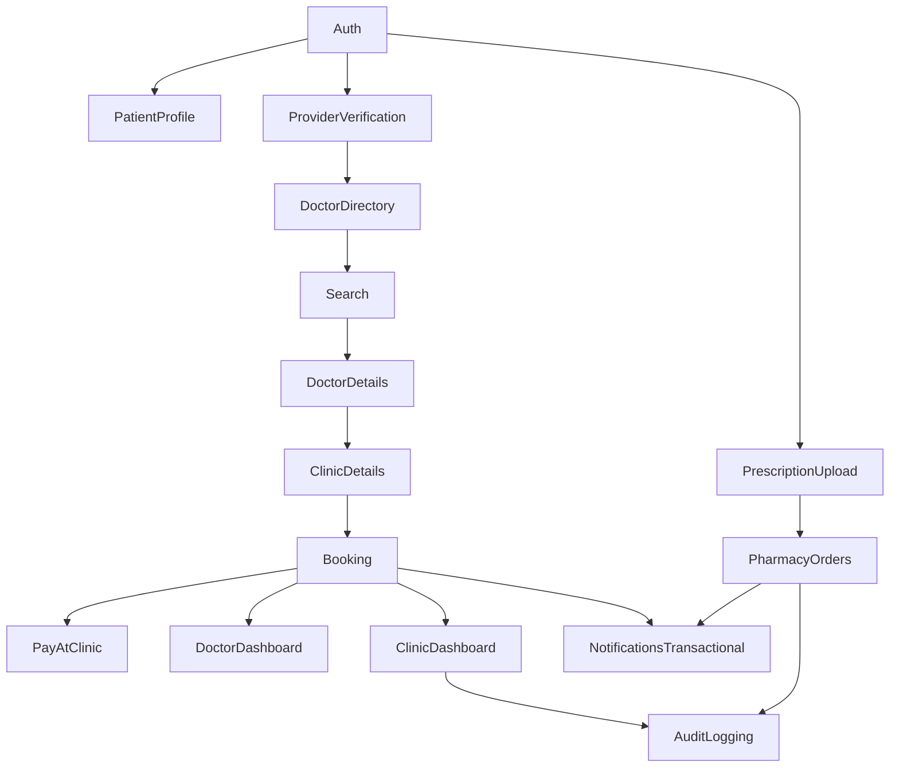
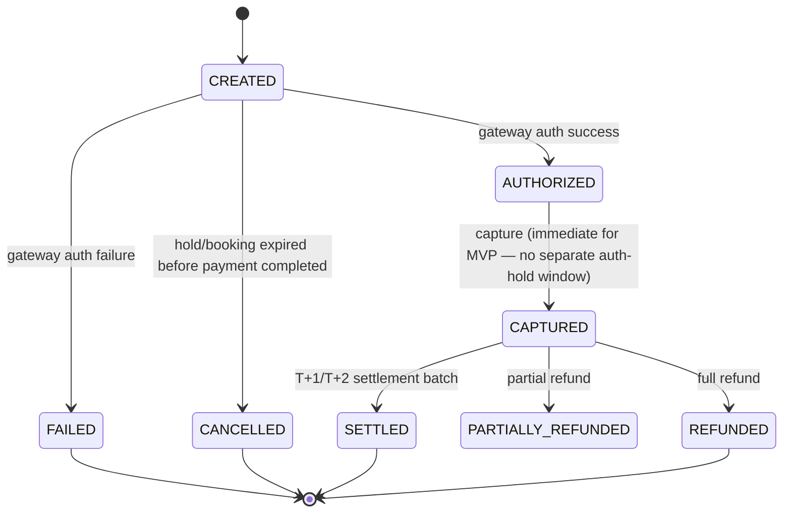
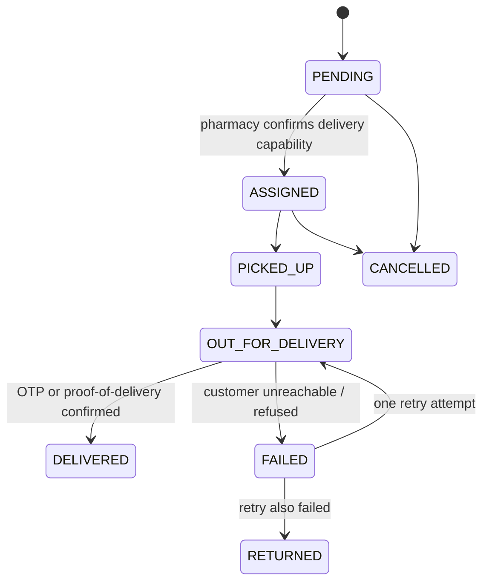
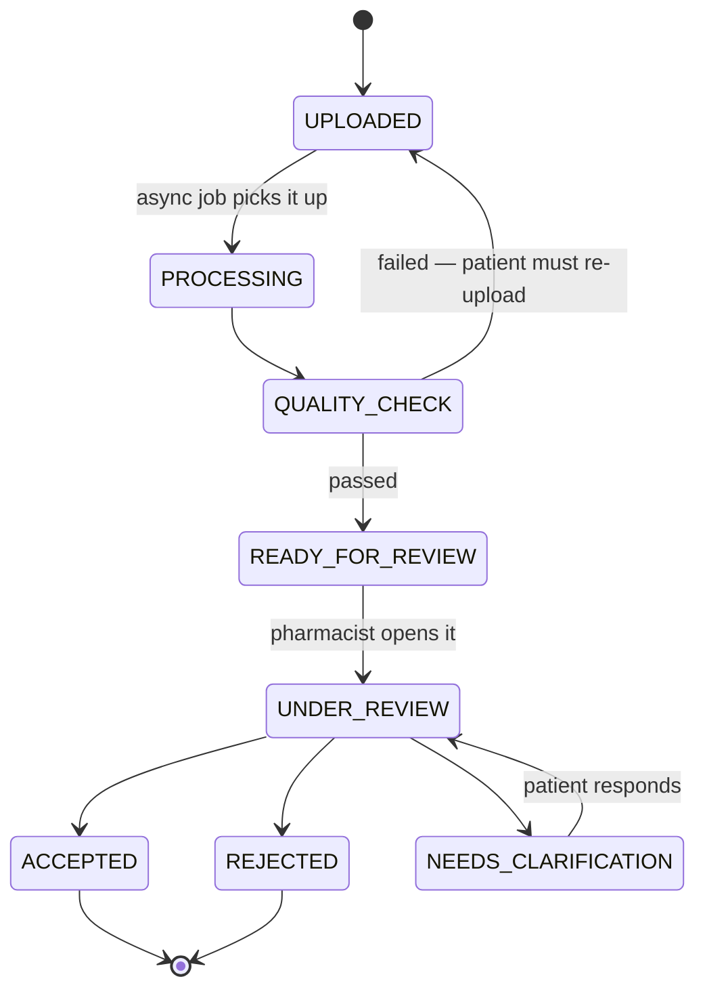

# FILE 10 — Implementation Readiness & Open Decisions Specification
**Version:** v1.0
**Status:** Draft for review — not yet approved
**Relationship to existing docs:** This document does not replace or restate `Healthcare-Super-Platform-Discovery-Document.md`, `MedSuper-SRS-Enterprise-Blueprint.md`, or `MedSuper_Flutter_Architecture.md`. Where those documents already answer something, this document references them by section instead of repeating them. Where they are silent, contradictory, or conceptually correct but not implementation-grade, this document says so explicitly and closes the gap.

**How to read this document:** Every `OPEN DECISION` block follows the same six-part structure (why it matters → options → recommendation → reasoning → cross-functional impact → what must be decided before coding). Skimming just the recommendations without the impact rows is the most common way this kind of document gets misused — don't.

---

## PART 1 — MVP SCOPE FREEZE

### 1.1 Critical framing

The SRS Appendix already proposes a 4-phase sequence. That sequence is directionally right (booking before pharmacy/lab, which is right) but it is **not a scope freeze** — it's a roadmap sketch. A roadmap sketch still lets "Doctor Dashboard" mean five different things to five different engineers. Below is the actual freeze, feature by feature, with the dependency reasoning made explicit — including places where this document **disagrees** with the SRS's own Phase 1 list.

### 1.2 Feature-by-feature table

| Feature | MVP | Phase 2 | Phase 3 | Reason |
|---|:---:|:---:|:---:|---|
| Authentication (phone OTP) | ✅ | | | Nothing works without it |
| Patient Profile (basic) | ✅ | | | Required for booking |
| Doctor Directory / Search | ✅ | | | Core discovery loop |
| Doctor Details | ✅ | | | Required before booking |
| Clinic Details | ✅ | | | Required — doctor is meaningless without a bookable location |
| Appointment Booking (hold → confirm) | ✅ | | | Core value proposition |
| Appointment Payment — **pay-at-clinic only** | ✅ | | | See 1.3 — online payment deliberately deferred one notch |
| Appointment Payment — **online** | | ✅ (early) | | Needs gateway selection (Part 5) resolved first; do not block booking launch on it |
| Doctor Dashboard (calendar, accept/reject) | ✅ | | | Supply side cannot function without it |
| Clinic Dashboard (queue, staff) | ✅ (reduced) | full version | | MVP needs queue + accept/reject only, not multi-branch analytics |
| Reviews | | ✅ | | **Disagreement with SRS Phase 1.** Verified-visit-only reviews require completed encounters. Day-1 MVP has zero completed visits — shipping Reviews in MVP means shipping an empty, trust-signaling feature that signals nothing. Ship it the moment there's a meaningful completed-encounter volume, not before. |
| Notifications — transactional tier only | ✅ | | | Booking confirmations, reminders |
| Notifications — safety-critical tier | | ✅ | | Only relevant once Lab exists (Phase 3) — do not build the tier logic prematurely, but **do** reserve the schema field for it now (see Part 3) |
| Notifications — marketing tier | | | ✅ | Not needed to prove the marketplace |
| Prescription — doctor-issued (structured) | | ✅ | | Needs Encounter/EMR (Phase 2 per SRS, correct) |
| Prescription — **patient-uploaded (photo)** | ✅ | | | **Disagreement with SRS Phase 2 placement.** The original product idea's core differentiator (per Discovery Doc) is "upload a prescription, get a pharmacy quote" — independent of the doctor-issued e-Rx system. This flow does not require Encounter/EMR at all; it only requires Prescription + Pharmacy Order. Deferring it to Phase 2 delays the single feature most likely to prove pharmacy-side demand. |
| Pharmacy Orders (accept/quote/fulfill) | ✅ | | | Paired with patient-uploaded prescriptions above |
| Pharmacy substitution flow | ✅ (simple) | full version | | MVP: single substitution proposal, no multi-round negotiation |
| Pharmacy delivery | | ✅ | | See Part 6 — pickup-first for MVP |
| Laboratory (search/book/pay) | | | ✅ | Matches SRS sequencing — correct, no disagreement |
| Lab home collection | | | ✅ | Operationally heaviest; do not front-load |
| Medical Records (unified timeline) | | ✅ | | Valuable but not blocking; a raw appointment list is enough for MVP |
| Family Accounts | | | ✅ | Adds identity-modeling complexity (who can book/see what for a dependent) with no MVP payoff |
| Telemedicine / video visits | | | ✅ (Phase 4 per SRS) | Correct — agree with SRS |
| Insurance | | | ✅ (Phase 4 per SRS) | Correct — agree with SRS |
| Wallet | | | ✅ (Phase 4 per SRS) | Correct — agree with SRS |
| Fraud Detection (automated) | | ✅ | | MVP needs a manual "flag for review" button only, not a rules engine |
| Analytics (provider-facing dashboards) | | ✅ | | Raw counts (today's appointments) suffice for MVP; trend charts are Phase 2 |
| Analytics (platform-facing warehouse/CDC) | | | ✅ | Needs transaction volume to be worth building |
| FHIR interoperability | | | ✅ (Phase 4 per SRS) | Correct — agree with SRS. **Flag:** nobody has asked for this yet from any real payer/hospital partner — treat as speculative until a partnership requires it |
| Offline Mode — **full outbox/sync** | | ✅ | | **Disagreement with Flutter Architecture doc's implied "ship offline-first from day one."** See 1.4 — this is more dangerous than it looks. |
| Offline Mode — **read-only cache** (view existing bookings/results without connectivity) | ✅ | | | Cheap, safe, high perceived value |
| RBAC (multi-role-per-account) | ✅ (basic) | full context-switch UX | | MVP: a user can hold one role at a time cleanly; the "switch context" UX polish is Phase 2 |
| Provider verification (KYC/license check) | ✅ (manual, admin-reviewed) | automated checks | | Cannot onboard a single real doctor without this — but it can be a human reviewing an uploaded PDF, not an integration |
| Audit logging | ✅ (core actions only) | full immutable pipeline | | Legal/compliance minimum from day one; the append-only infrastructure hardening can mature in Phase 2 |

### 1.3 Why online payment is split out of "Appointment Booking"

This is the single highest-leverage scope decision in this document. Booking + pay-at-clinic is a complete, shippable, valuable loop that requires **zero** external payment gateway integration, no PCI-adjacent surface, no webhook handling, no settlement logic. Booking + online payment requires all of that (Part 5). Bundling them means the entire MVP timeline is hostage to a vendor procurement/compliance process (gateway KYB approval in Egypt/KSA/UAE routinely takes 2–6 weeks and is **outside engineering's control**). Ship pay-at-clinic first; online payment lands as a fast-follow the moment the gateway is contracted, without blocking the initial launch.

### 1.4 Why "full offline-first" is downgraded for MVP

The Flutter Architecture doc's Outbox pattern (Decision #6) is well-designed *as client architecture* — the flaw is applying it to **new bookings** specifically. An appointment `HELD` state has a 5-minute TTL (Flutter doc §4). An offline-queued booking action cannot honor a 5-minute TTL because the device may be offline for hours. Queuing a booking offline therefore either (a) silently fails to hold the slot the user thought they'd secured, or (b) requires the backend to accept a "book now, resolve later" semantic that doesn't exist anywhere else in the state machine. **Recommendation:** implement the Outbox for **cancel/reschedule of already-confirmed appointments** (safe — no TTL, no slot contention) and for **read caching** (safe), but explicitly do **not** offer offline queuing for *new* bookings or payments in MVP. This is formalized as `DEC-011` in Part 10.

### 1.5 Feature dependency graph (MVP only)

### 1.6 MVP acceptance criteria

An MVP is not "the features exist." It is done when:

1. A new patient can complete OTP signup → search → book a doctor → pay at clinic → receive a confirmation notification, **in under 4 taps after landing on a doctor's slot list**, matching the Flutter doc's own design goal (§5).
2. A clinic can accept/reject/reschedule a booking and the patient is notified within 30 seconds of the action (p95).
3. A patient can photograph a prescription, have it routed to at least one real pharmacy, receive a price/availability quote, and approve it — end to end, with a pharmacist confirming that the flow never auto-approves a substitution.
4. Double-booking the same slot from two devices simultaneously is **impossible** — verified by an actual concurrency test, not code review (see Part 3.5 race-condition note).
5. Every PHI read/write in the above flows produces an audit log row (SRS §25 minimum bar).
6. No card data ever transits or lands on MedSuper's own servers unencrypted/unattended (gateway-hosted fields or tokenization only) — verified before any online-payment fast-follow, not just at MVP.
7. Zero P0 crashes in Crashlytics across a defined smoke-test device matrix (see Part 12 — Testing readiness is currently the lowest-scoring area; this criterion cannot be honestly claimed "met" until that's fixed).

### 1.7 MVP FREEZE — definitive build list

> Auth (OTP) · Patient Profile (basic) · Provider Verification (manual) · Doctor/Clinic Directory · Search · Doctor & Clinic Details · Appointment Booking (hold→confirm) · Pay-at-Clinic · Doctor Dashboard · Clinic Dashboard (queue + accept/reject) · Prescription Upload (photo) · Pharmacy Orders (quote/substitute/accept) · Notifications (transactional tier, push + SMS fallback) · Basic RBAC (single active role) · Manual provider verification · Core audit logging · Read-only offline cache.

Everything else in the feature list is explicitly **not** MVP. If a stakeholder asks for anything outside this list before Section 1.6's acceptance criteria are met, that is scope creep and should be named as such, not quietly absorbed.

---

## PART 2 — API CONTRACT SPECIFICATION

### 2.1 Honesty check on the existing documentation

The SRS's "API design" material (referenced as §16 in the Flutter Architecture doc) is **conceptual** — it names service groupings and one illustrative example (`POST /v1/appointments/hold`), not an enumerated contract. The Flutter Architecture doc then built interceptor/idempotency assumptions on top of that conceptual reference as if it were settled. It wasn't. **This Part 2 is where those contracts actually get defined for the first time** — treat everything below as new, proposed, and requiring backend sign-off, not as "extracted from an existing spec."

### 2.2 Standard conventions (apply to every endpoint below)

| Convention | Rule |
|---|---|
| Versioning | URI-based: `/v1/...`. Breaking changes get a new version prefix; additive changes do not. |
| Base error envelope | `{ "error": { "code": "STRING_ENUM", "message": "human-readable", "correlation_id": "uuid", "details": [ ... optional field-level ... ] } }` |
| Validation error shape | `details: [{ "field": "slotId", "issue": "REQUIRED" }]` |
| Auth error | `401` + `code: "UNAUTHENTICATED"` (missing/expired token) vs `403` + `code: "FORBIDDEN"` (valid token, wrong role/permission) — **never conflate these two**, the client's retry logic (silent refresh vs hard logout) depends on the distinction |
| Pagination | Cursor-based: request `?cursor=<opaque>&limit=20`; response `{ "items": [...], "nextCursor": "opaque-or-null" }`. No offset/page-number pagination anywhere — it doesn't survive concurrent writes to a live booking list. |
| Sorting | `?sort=field:asc\|desc`, whitelisted fields only per endpoint (documented per-endpoint, not global) |
| Filtering | Explicit query params per endpoint, not a generic query language, for MVP |
| Idempotency | Required via `Idempotency-Key` header on every financial/booking `POST`. Server stores `(idempotency_key, request_hash, response, expiry)`; a repeated key with a *different* body is a `409 IDEMPOTENCY_KEY_REUSE` error, not a silent overwrite |
| Correlation IDs | `X-Correlation-Id` header, client-generated if absent server-generates one; propagated through every downstream service call and into audit logs |
| Timestamps | ISO-8601, UTC, always (`2026-08-08T14:30:00Z`) — client converts to local display, server never stores or reasons about local time |
| Rate limits | Returned via `X-RateLimit-Remaining` / `X-RateLimit-Reset` headers; `429` with `Retry-After` on breach |
| Audit requirement | Any endpoint touching PHI (patient identity, encounter, prescription, lab result) **must** write an audit_logs row server-side in the same transaction as the business write — not as a best-effort async afterthought |

### 2.3 Full contracts — MVP-critical endpoints

#### `POST /v1/auth/otp/request`
- **Auth:** none · **Authorization:** none
- **Purpose:** request an OTP to a phone number for login or signup
- **Request body:** `{ "phone": "+201001234567" }` — `phone`: string, required, E.164 format, validated by regex server-side
- **Validation:** rate-limited per phone number (e.g., 3 requests / 10 min) to prevent SMS-bombing abuse
- **Response `200`:** `{ "requestId": "uuid", "expiresInSeconds": 300 }`
- **Errors:** `429 RATE_LIMITED`, `400 INVALID_PHONE`
- **Idempotency:** not required (each call intentionally issues a new OTP)
- **Audit:** log the request attempt (phone, ip, timestamp) — this is a security log, not a PHI log

#### `POST /v1/auth/otp/verify`
- **Auth:** none · **Authorization:** none
- **Request body:** `{ "requestId": "uuid", "code": "123456" }`
- **Validation:** max 5 attempts per `requestId`, then lock and require a new `otp/request`
- **Response `200`:** `{ "accessToken": "...", "refreshToken": "...", "expiresIn": 3600, "userId": "uuid", "isNewUser": true }`
- **Errors:** `400 INVALID_CODE`, `410 CODE_EXPIRED`, `423 TOO_MANY_ATTEMPTS`

#### `GET /v1/doctors/search`
- **Auth:** optional (public search allowed, personalization improves if authenticated) · **Authorization:** none
- **Query params:** `specialty` (code, optional), `lat`/`lng` (required if sorting by distance), `radiusKm` (default 15), `date` (ISO date, optional — filters to doctors with availability that day), `sort` (`distance:asc` \| `rating:desc` \| `price:asc`), `cursor`, `limit` (default 20, max 50)
- **Response `200`:** `{ "items": [ { "doctorId", "name", "specialty", "clinicBranchId", "clinicName", "distanceKm", "rating", "reviewCount", "consultFee", "currency", "nextAvailableSlot": "2026-08-09T10:00:00Z" } ], "nextCursor": "..." }`
- **Rate limit:** generous (public, high-frequency) but still capped to prevent scraping
- **Audit:** not required (non-PHI, public data)

#### `GET /v1/doctors/{doctorId}/slots`
- **Path params:** `doctorId` (uuid) · **Query:** `clinicBranchId` (required — a doctor can have different slots per affiliation), `from`/`to` (date range, max 14-day window per request)
- **Response `200`:** `{ "slots": [ { "slotId", "startAt", "endAt", "status": "OPEN" } ] }` — only `OPEN` slots returned; `HELD`/`BOOKED` are omitted, not shown-as-disabled, to avoid leaking another patient's in-progress hold

#### `POST /v1/appointments/hold`
- **Auth:** required (patient) · **Authorization:** role = PATIENT
- **Headers:** `Idempotency-Key` required
- **Request:** `{ "doctorClinicAffiliationId": "uuid", "slotId": "uuid", "patientId": "uuid" }`
  - `patientId` must equal the authenticated user's own patient id, or a dependent they're authorized for (Phase 3 — MVP: must equal self, `403` otherwise)
- **Validation:** slot must be `OPEN` at time of hold attempt; concurrency-safe (see Part 3.5)
- **Response `201`:** `{ "holdId": "uuid", "slotId": "uuid", "expiresAt": "2026-08-08T14:35:00Z", "status": "HELD" }`
- **Errors:** `409 SLOT_ALREADY_HELD`, `409 SLOT_ALREADY_BOOKED`, `404 SLOT_NOT_FOUND`
- **Rate limit:** capped per patient (e.g., 10 holds / hour) to prevent slot-hoarding abuse
- **Audit:** required (PHI-adjacent — links patient to a provider interaction)

#### `POST /v1/appointments/{holdId}/confirm`
- **Auth:** required (patient) · **Headers:** `Idempotency-Key` required
- **Request:** `{ "paymentMethod": "PAY_AT_CLINIC" | "ONLINE", "paymentIntentId": "uuid-if-online" }`
- **Response `200`:** `{ "appointmentId": "uuid", "status": "CONFIRMED" }`
- **Errors:** `410 HOLD_EXPIRED` (client must restart from `/hold`), `402 PAYMENT_REQUIRED` (online path, payment not yet captured)
- **Audit:** required

#### `POST /v1/appointments/{appointmentId}/cancel`
- **Auth:** required (patient, or clinic staff with permission) · **Authorization:** owner patient OR clinic staff of the associated branch
- **Request:** `{ "reason": "PATIENT_REQUEST" | "PROVIDER_REQUEST" | "OTHER", "note": "optional string" }`
- **Business rule enforced server-side:** cancellation fee tier computed from `now()` vs `appointment.startAt`, per the policy_configs table (Part 3) — **not** computed client-side and trusted (the Flutter doc's client-side fee preview is UX-only; server is authoritative)
- **Response `200`:** `{ "status": "CANCELLED", "refundAmount": 0, "feeApplied": 0 }`
- **Audit:** required

#### `POST /v1/prescriptions/upload`
- **Auth:** required (patient) · **Headers:** `Idempotency-Key` required, `Content-Type: multipart/form-data`
- **Request:** multipart file(s) + `{ "notes": "optional string" }`
- **Validation:** file type (jpeg/png/pdf), max size (e.g., 10MB/file), max 5 files per prescription
- **Response `201`:** `{ "prescriptionId": "uuid", "status": "UPLOADED" }` — processing (quality check, OCR) happens async; client polls or receives a push on state change (Part 7)
- **Audit:** required (PHI)

#### `POST /v1/pharmacy-orders/{orderId}/quote`
- **Auth:** required (pharmacy staff) · **Authorization:** role = PHARMACY_STAFF, scoped to the branch the order was routed to
- **Request:** `{ "items": [ { "prescriptionItemId": "uuid", "status": "AVAILABLE"|"UNAVAILABLE"|"SUBSTITUTED", "substituteDrugCode": "optional", "unitPrice": 45.0 } ], "estimatedReadyMinutes": 30 }`
- **Response `200`:** `{ "orderId", "status": "SUBSTITUTION_PROPOSED"|"ACCEPTED", "totalPrice": 180.0, "currency": "EGP" }`
- **Audit:** required

#### `POST /v1/webhooks/payments/{provider}`
- **Auth:** provider-specific signature verification (HMAC header), **not** bearer token
- **Idempotency:** mandatory via provider's own event id, stored in `webhook_events` (Part 3) — every event processed **exactly once** regardless of provider retry behavior
- **Response:** always `200` quickly (process async internally) — a slow/failed response causes the provider to retry, which is fine *because* of the idempotency store, but a `5xx` here should never be returned for business-logic failures, only genuine infra failures
- **Audit:** required, and this endpoint additionally needs its own security log distinct from the audit log (signature failures should alert, not just log)

### 2.4 API CONTRACTS STILL REQUIRED

The following need the same full-template treatment before their respective phase starts — listed here so they aren't forgotten, not because they're needed for MVP:

`GET /v1/appointments/{id}` · `GET /v1/patients/me` · `PATCH /v1/patients/me` · `GET /v1/notifications` · `PATCH /v1/notifications/{id}/read` · `POST /v1/reviews` (Phase 2) · `POST /v1/lab-orders` (Phase 3) · `GET /v1/lab-orders/{id}/results` (Phase 3) · `POST /v1/delivery-orders` (Phase 2, gated on Part 6 decision) · full Admin/verification API set (needed the moment a second real provider onboards, i.e., essentially immediately — do not actually leave this for "later") · `POST /v1/payment-intents` (gated on Part 5 gateway decision).

---

## PART 3 — DATABASE IMPLEMENTATION SCHEMA

### 3.1 Engine decision

**PostgreSQL**, per the SRS's own architecture direction (per-service ownership, need for strong relational integrity on financial/booking data, JSONB where genuinely semi-structured data exists — audit payloads, webhook payloads, policy config values). No document store is justified for MVP; introducing one (e.g., for the Analytics warehouse, SRS §26) is explicitly a Phase 3+ concern and should be a separate OLAP-oriented store (fed by CDC), not the transactional Postgres instances.

### 3.2 Cross-cutting conventions (apply to every table below)

- **Primary keys:** `uuid` (v7 preferred if the DB driver ecosystem supports it — time-orderable UUIDs reduce index fragmentation vs pure v4), not auto-increment integers (avoids leaking volume/sequence information across a public-facing API).
- **Audit columns on every table:** `created_at timestamptz not null default now()`, `updated_at timestamptz not null default now()` (trigger-maintained). `deleted_at timestamptz null` on any table representing a real-world entity a user can "remove" (patients, doctors, clinics, addresses) — **soft delete only**, hard delete is never used for anything PHI-adjacent, for audit/compliance reasons (SRS §25 requires 6–7 year retention, which is incompatible with hard deletion).
- **Tenant/organization boundary:** every provider-side table (`doctors`, `clinics`, `pharmacies`, `laboratories` and everything hanging off them) carries an implicit tenant boundary through its own `id` as the partition key candidate (SRS §27 "sharding readiness" already flags this) — **no separate `tenant_id` column is needed at MVP scale**, but the schema below is written so one could be added later without restructuring foreign keys (a `region_code` column is included on the top-level provider tables now specifically to make that migration painless later — see 3.4).
- **Optimistic locking:** any table with a state machine (`appointments`, `pharmacy_orders`, `lab_orders`, `payment_intents`) carries a `version integer not null default 1` column, incremented on every update, checked via `WHERE id = ? AND version = ?` — this is the actual mechanism (not just documentation) that prevents the race conditions flagged in 3.5.

### 3.3 Schema by service boundary

#### Identity & Access
| Table | Key columns | Notes |
|---|---|---|
| `users` | `id` PK, `phone` unique not null, `email` unique nullable, `status` enum(`ACTIVE`,`SUSPENDED`), `created_at`, `deleted_at` | Phone is the primary identifier (matches OTP-first auth); email optional |
| `role_memberships` | `id` PK, `user_id` FK→users, `role_code` FK→roles, `context_type` enum(`PATIENT`,`DOCTOR`,`CLINIC_STAFF`,`PHARMACY_STAFF`,`LAB_STAFF`,`ADMIN`), `context_id` uuid nullable, `status` enum(`ACTIVE`,`REVOKED`) | This is the literal implementation of SRS §0's "identity decoupled from role-context." **See DEC-006** — the Flutter two-flavor split doesn't yet honor what this table already allows. |
| `roles` / `permissions` / `role_permissions` | lookup/join tables | Static seed data, not user-editable in MVP |
| `otp_requests` | `id`, `phone`, `code_hash`, `purpose`, `expires_at`, `consumed_at`, `attempts int default 0` | `code_hash` — never store the raw OTP |
| `devices` | `id`, `user_id` FK, `fcm_token`, `platform`, `app_version`, `last_seen_at` | Needed by Notification Service to target push |
| `refresh_tokens` | `id`, `user_id` FK, `token_hash`, `device_id` FK, `expires_at`, `revoked_at` | Enables the Flutter Auth interceptor's silent-refresh flow (Flutter doc §9) |

#### Provider Directory
| Table | Key columns | Notes |
|---|---|---|
| `specialties` | `code` PK, `name_en`, `name_ar`, `parent_code` nullable | Self-referencing for sub-specialties |
| `addresses` | `id` PK, `line1`, `city`, `region_code`, `country_code`, `geo_lat numeric(9,6)`, `geo_lng numeric(9,6)` | **Missing from the conceptual ERD — added here.** Reused by clinics/pharmacies/labs/delivery, not duplicated per-entity |
| `doctors` | `id` PK, `user_id` FK unique, `specialty_code` FK, `license_number`, `license_verified_at` nullable, `status` enum(`PENDING`,`VERIFIED`,`SUSPENDED`), `rating_avg numeric(2,1)`, `rating_count int default 0` | |
| `clinics` | `id` PK, `legal_name`, `brand_name`, `tax_id`, `region_code`, `status`, `verified_at` nullable | |
| `clinic_branches` | `id` PK, `clinic_id` FK, `address_id` FK, `phone`, `status` | |
| `doctor_clinic_affiliations` | `id` PK, `doctor_id` FK, `clinic_branch_id` FK, `consult_fee numeric(10,2)`, `currency char(3)`, `status` enum(`ACTIVE`,`PAUSED`) | **Unique constraint** on (`doctor_id`,`clinic_branch_id`) — implements the SRS's many-to-many redesign concretely |
| `pharmacies` / `pharmacy_branches` | mirrors clinic structure | `pharmacy_branches` adds `delivery_capable boolean` |
| `laboratories` / `lab_branches` | mirrors clinic structure | `lab_branches` adds `home_collection_capable boolean` |
| `provider_verification_documents` | `id`, `provider_type` enum, `provider_id`, `doc_type`, `file_url`, `status`, `reviewed_by` FK→users, `reviewed_at` | Backs the "manual KYC" MVP decision from Part 1 |

#### Scheduling
| Table | Key columns | Notes |
|---|---|---|
| `schedule_templates` | `id`, `doctor_clinic_affiliation_id` FK, `weekday smallint`, `start_time`, `end_time`, `slot_duration_minutes` | Generates `slots` via a scheduled job, not on-demand |
| `slots` | `id`, `doctor_clinic_affiliation_id` FK, `start_at`, `end_at`, `status` enum(`OPEN`,`HELD`,`BOOKED`,`BLOCKED`), `version int` | **Composite index** on (`doctor_clinic_affiliation_id`,`start_at`) for the search/availability query path |
| `appointment_holds` | `id`, `slot_id` FK, `patient_id` FK, `expires_at`, `status` enum(`ACTIVE`,`EXPIRED`,`CONVERTED`) | **Partial unique index**: `UNIQUE (slot_id) WHERE status = 'ACTIVE'` — this single constraint is what actually prevents double-holding, not application logic (see 3.5) |
| `appointments` | `id`, `slot_id` FK unique, `patient_id` FK, `doctor_clinic_affiliation_id` FK, `status` enum(9 values per Flutter doc §5 state machine), `payment_intent_id` FK nullable, `cancelled_by`, `cancelled_reason`, `rescheduled_from_appointment_id` FK nullable, `version int` | |

#### Encounter/EMR (highest sensitivity — strictest access controls per SRS §28)
| Table | Key columns | Notes |
|---|---|---|
| `health_records` | `id`, `patient_id` FK unique | One root record per patient — the literal "Patient Health Graph" |
| `encounters` | `id`, `health_record_id` FK, `appointment_id` FK nullable, `doctor_id` FK, `encounter_type`, `notes_encrypted bytea`, `status` enum(`OPEN`,`COMPLETED`), `occurred_at` | `notes_encrypted` — application-layer encryption, not just disk-level, given clinical note sensitivity |
| `consents` | `id`, `patient_id` FK, `consent_type`, `granted boolean`, `granted_at`, `revoked_at`, `version int` | **Missing from conceptual ERD — added here.** Required before any data-sharing feature (family accounts, insurance, analytics opt-in) can legally ship |

#### Prescription
| Table | Key columns | Notes |
|---|---|---|
| `drug_catalog` | `code` PK, `generic_name`, `controlled_substance boolean`, `requires_prescription boolean` | Seed data; licensing this catalog is itself a Part 4 external-service decision in some markets |
| `prescriptions` | `id`, `encounter_id` FK nullable, `patient_id` FK, `doctor_id` FK nullable, `source` enum(`DOCTOR_ISSUED`,`PATIENT_UPLOADED`), `status` (Part 7 state machine), `expires_at` | `encounter_id` nullable is deliberate — patient-uploaded prescriptions (MVP) have no encounter |
| `prescription_items` | `id`, `prescription_id` FK, `drug_code` FK nullable, `drug_name_free_text`, `dose`, `frequency`, `duration_days`, `quantity` | `drug_code` nullable because OCR/manual entry may not resolve to a catalog match |
| `prescription_images` | `id`, `prescription_id` FK, `file_url`, `quality_check_status` enum, `blur_score numeric` | **Missing from conceptual ERD — added here** |

#### Pharmacy Fulfillment
| Table | Key columns | Notes |
|---|---|---|
| `pharmacy_orders` | `id`, `prescription_id` FK, `patient_id` FK, `pharmacy_branch_id` FK nullable, `status` (Flutter doc §5 state machine), `payment_intent_id` FK nullable, `fulfillment_type` enum(`PICKUP`,`DELIVERY`), `version int` | `pharmacy_branch_id` nullable while still broadcasting to multiple candidate pharmacies |
| `pharmacy_order_broadcasts` | `id`, `pharmacy_order_id` FK, `pharmacy_branch_id` FK, `sent_at`, `responded_at`, `response` enum(`ACCEPTED`,`DECLINED`,`TIMEOUT`) | **Missing from conceptual ERD — added here.** Required for "nearest pharmacy / best offer" broadcast, and this is exactly where the first-accept-wins race condition lives (3.5) |
| `pharmacy_order_items` | `id`, `pharmacy_order_id` FK, `prescription_item_id` FK, `status` enum(`AVAILABLE`,`UNAVAILABLE`,`SUBSTITUTED`), `substituted_drug_code` FK nullable, `unit_price`, `quantity` | |

#### Payment
| Table | Key columns | Notes |
|---|---|---|
| `payment_intents` | `id`, `payer_user_id` FK, `payable_type` enum(`APPOINTMENT`,`PHARMACY_ORDER`,`LAB_ORDER`), `payable_id`, `amount`, `currency char(3)`, `status` (Part 5 state machine), `idempotency_key` unique, `version int` | Polymorphic `payable_type`/`payable_id` — the shared ledger concept from SRS §0 |
| `payment_splits` | `id`, `payment_intent_id` FK, `payee_type` enum(`PLATFORM`,`PROVIDER`), `payee_id` nullable, `amount`, `type` enum(`COMMISSION`,`PROVIDER_SHARE`) | |
| `refunds` | `id`, `payment_intent_id` FK, `amount`, `reason`, `status` enum(`REQUESTED`,`PROCESSING`,`COMPLETED`,`FAILED`) | |
| `provider_ledger_entries` | `id`, `provider_type`, `provider_id`, `entry_type` enum(`EARNING`,`COMMISSION_DEDUCTION`,`PAYOUT`,`ADJUSTMENT`), `amount`, `related_payment_intent_id` FK nullable | **Missing from conceptual ERD — added here.** Without this table, cash/pay-at-clinic transactions have no way to record that the platform is still owed a commission — see Part 5 |
| `webhook_events` | `id`, `provider`, `event_type`, `payload jsonb`, `signature_verified boolean`, `idempotency_key` unique, `processed_at` | **Missing from conceptual ERD — added here.** Without this, webhook retries from the payment gateway can double-process a capture or refund |

#### Notification / Review / Audit / Fraud
| Table | Key columns | Notes |
|---|---|---|
| `notifications` | `id`, `user_id` FK, `tier` enum(4 values), `channel`, `template_code`, `status`, `sent_at`, `read_at` | |
| `notification_preferences` | `user_id` FK, `tier`, `channel`, `enabled boolean` | Users can opt out of `INFORMATIONAL`/`MARKETING`, **never** `SAFETY_CRITICAL` — enforce server-side, not just client-side |
| `reviews` | `id`, `patient_id` FK, `subject_type`, `subject_id`, `encounter_id` FK **not null**, `rating smallint check (rating between 1 and 5)`, `comment`, `status` | `encounter_id NOT NULL` is the actual database-level enforcement of "verified-visit-only" — not an application-layer suggestion |
| `audit_logs` | `id`, `actor_user_id`, `actor_role_membership_id`, `action`, `resource_type`, `resource_id`, `subject_patient_id` nullable, `reason_code` nullable, `correlation_id`, `source_ip`, `occurred_at` | Append-only; **recommend a genuinely separate database/instance**, not just a table with restricted grants, given the 6–7 year retention requirement and the fact that it must survive even if the operational DB is rolled back |
| `fraud_flags` | `id`, `subject_type`, `subject_id`, `flag_type`, `severity`, `status` | Phase 2 per Part 1 |

#### Delivery (new — required for Part 6, absent from the conceptual ERD entirely)
| Table | Key columns | Notes |
|---|---|---|
| `delivery_orders` | `id`, `pharmacy_order_id` FK, `courier_type` enum(`PHARMACY_OWN`,`THIRD_PARTY`), `address_id` FK, `status` (Part 6 state machine), `otp_code_hash` nullable, `proof_of_delivery_url` nullable, `fee`, `eta_at` | |

#### Admin / Policy
| Table | Key columns | Notes |
|---|---|---|
| `policy_configs` | `id`, `region_code`, `policy_type` enum(`COMMISSION_RATE`,`CANCELLATION_TIER`,`NOTIFICATION_QUIET_HOURS`), `value jsonb`, `effective_from`, `created_by` FK | This is what makes commission/cancellation rules "data, not code" as the Flutter doc's persona section assumed — but that table didn't actually exist in the conceptual ERD until now |

### 3.4 On the "region_code" columns

Several tables above carry a `region_code` that nothing currently reads. This is intentional groundwork for SRS §27's sharding-readiness goal, **not** a Phase-1 feature. Do not build region-based routing logic now; do make sure the column exists so a future partitioning migration doesn't require a schema change on live financial tables.

### 3.5 Dangerous relationships & race conditions — explicit call-outs

1. **Double-hold on the same slot.** Two patients tap "Book" within milliseconds of each other. Mitigation: the partial unique index on `appointment_holds (slot_id) WHERE status='ACTIVE'` (3.3) makes the second insert fail at the database level — the application must catch that constraint violation and return `409 SLOT_ALREADY_HELD`, not retry-and-succeed.
2. **Pharmacy broadcast double-accept.** In "nearest/best-offer" mode, an order broadcasts to N pharmacy branches. Two branches tap "Accept" near-simultaneously. Mitigation: `pharmacy_orders.version` optimistic lock — the first accept's `UPDATE ... WHERE version = ?` succeeds and increments version; the second's `UPDATE` affects 0 rows, and the application must translate that into "this order was already claimed" for the second pharmacy, not a generic 500.
3. **Hold-expiry vs confirm race.** A hold expires at exactly the same moment the patient taps "Confirm & Pay." Mitigation: `confirm` must re-check `appointment_holds.status = 'ACTIVE' AND expires_at > now()` inside the same transaction that flips status to `CONFIRMED`, not check-then-act across two calls.
4. **Webhook double-processing.** Payment gateway retries a webhook because it didn't get a fast enough `200`. Mitigation: `webhook_events.idempotency_key` unique constraint, checked before any business-logic side effect runs.
5. **Cash-collected-but-commission-unrecorded.** A clinic collects cash at the desk and has no technical incentive to ever open the app again to confirm it. Mitigation: `provider_ledger_entries` should be written **at appointment COMPLETED time**, not waiting on any provider action — the commission owed is a platform-side fact independent of the provider acknowledging it.

### 3.6 Unnecessary duplication identified

The conceptual documentation risked defining "current doctor rating" both as a derived aggregate and as something recomputed ad hoc per request. **Resolution:** `doctors.rating_avg`/`rating_count` are denormalized, trigger-maintained columns (updated on `reviews` insert/update), not computed at read time — this is a deliberate, documented denormalization for read performance, not an oversight.

---

## PART 4 — EXTERNAL SERVICE DECISIONS

| Service | Requirement | Options | Recommended | Reason | Cost | Lock-in risk | MVP or Later |
|---|---|---|---|---|---|---|---|
| Maps / Geocoding / Distance | Doctor/pharmacy/lab distance search, address entry | Google Maps Platform, Mapbox, HERE | **Google Maps Platform** | Best Egypt+GCC coverage/accuracy for geocoding and place autocomplete; Flutter SDK is first-party and mature | Highest of the three, usage-based — model this cost explicitly at MVP volume before committing | Medium — geocoded addresses are portable, but UI/SDK integration isn't trivial to swap | MVP |
| Push Notifications | Already decided | Firebase Cloud Messaging | **FCM** (already in stack) | No decision needed — Flutter doc already pins this | Free | Low | MVP |
| SMS / OTP | Phone verification + transactional SMS fallback | Twilio, Vonage, Unifonic, **Firebase Phone Auth** (for OTP specifically) | **Firebase Phone Auth** for OTP; **Unifonic or Vonage** for transactional SMS (reminders, non-auth) | Reduces vendor count by reusing the already-committed Firebase relationship for auth; regional aggregators have better Egypt/GCC deliverability and Arabic sender-ID support than Twilio for non-auth SMS | Firebase Auth SMS has its own per-country pricing — verify Egypt pricing specifically before committing, it is not uniformly cheap | Medium (phone auth) | MVP |
| Email | Transactional email (receipts, password-adjacent flows) | SendGrid, AWS SES, Postmark | **AWS SES** | Cheapest at scale, acceptable deliverability with proper domain setup; not customer-facing enough at MVP to justify Postmark's premium | Low | Low | MVP |
| Object Storage (prescriptions, lab PDFs, images) | Encrypted, access-controlled binary storage | AWS S3, Cloudflare R2, Azure Blob | **AWS S3**, region selected per data-residency decision (DEC-009) | Mature IAM/bucket-policy model for the strict per-resource access control PHI requires | Usage-based, moderate | Medium | MVP |
| CDN | Static assets, profile photos | CloudFront, Cloudflare | **CloudFront** (pairs naturally with S3) | Simplicity of a single-vendor storage+CDN pipeline for MVP | Low | Low | MVP |
| Payment Gateway | See Part 5 in full | Paymob, HyperPay, PayTabs, Moyasar | See Part 5 | — | — | High | MVP (Egypt only) |
| Analytics (product) | Funnel/event tracking | Firebase Analytics, Amplitude, Mixpanel | **Firebase Analytics** for MVP | Already in stack (Firebase Messaging/Crashlytics); Amplitude/Mixpanel are strictly better for deep funnel work but are a Phase 2 upgrade, not an MVP requirement | Free at MVP volume | Low | MVP |
| Crash Reporting | Already decided | Firebase Crashlytics | **Crashlytics** (already in stack) | No decision needed | Free | Low | MVP |
| Monitoring / Logging (backend) | Service health, error tracking | Datadog, Grafana+Prometheus+Loki (self-hosted), Sentry | **Sentry** (error tracking) + **Grafana/Prometheus** (metrics) for MVP | Datadog's per-host pricing is disproportionate at MVP scale; the open-source stack is more setup work but avoids a five-figure monthly bill for a pre-revenue product | Low (self-hosted) vs high (Datadog) | Low | MVP |
| Video Consultation | Telehealth (Phase 4) | Twilio Video, Agora, Daily.co | Defer | Not MVP — evaluate when Phase 4 actually starts, market shifts fast here | — | — | Later |
| OCR | Prescription-assist only (Part 7) | Google Cloud Vision, AWS Textract, Azure Form Recognizer | **Google Cloud Vision** | Best general handwriting/print OCR accuracy of the three for MVP purposes; Textract's medical-specific features aren't needed since OCR here only pre-fills fields for pharmacist confirmation, never auto-decides | Usage-based, low at MVP volume | Medium | MVP (assist-only, per Part 7) |
| Search (doctor/pharmacy discovery) | Text + geo search | Postgres full-text + PostGIS, Elasticsearch, Meilisearch, Algolia | **Postgres full-text + PostGIS** for MVP | Avoids operating a second search cluster before there's enough catalog volume (5,000 doctors per SRS Year-1 target) to need it; revisit once search latency/relevance actually degrades | Included in existing DB cost | Low | MVP |
| Delivery / Courier | See Part 6 | Bosta, Mylerz (Egypt); regional partners (GCC) | See Part 6 | — | — | Medium | Later (Phase 2) |
| Identity Verification (provider KYC) | License/document verification | Manual (MVP) vs Sumsub/Persona (automated) | **Manual** for MVP | Matches Part 1's MVP scope decision — automating this before there's onboarding volume to justify it is premature spend | Low (ops time only) | — | MVP (manual) |

**Cross-cutting note on data residency:** several of the above (S3 region, database hosting region) are gated on `DEC-009` (Part 10) — Saudi health-data localization requirements specifically need legal confirmation before a region is locked in, and that decision affects Storage, Database, and CDN simultaneously. Do not let three different engineers pick three different regions for three different services.

---

## PART 5 — PAYMENT ARCHITECTURE

### 5.1 Architecture (provider-agnostic)

- **PaymentIntent lifecycle:** one `payment_intents` row per payable (appointment / pharmacy order / lab order), created the moment the user initiates payment, never before (no speculative intents).
- **Failed payments:** `FAILED` is terminal for that intent; the client creates a **new** intent (new idempotency key) to retry — intents are never mutated back from `FAILED` to `CREATED`.
- **Duplicate payments:** prevented at three layers — `Idempotency-Key` header (Part 2), `payment_intents.idempotency_key` unique constraint, and `webhook_events.idempotency_key` for the gateway callback side. All three exist because they close different failure windows (client double-tap, network retry, gateway retry respectively).
- **Payment expiration:** an intent tied to an `appointment_hold` inherits that hold's 5-minute TTL — if payment isn't captured before the hold expires, the intent moves to `CANCELLED` and the slot releases, full stop, no grace window for MVP.
- **Cash / pay-at-clinic:** does **not** create a `payment_intents` row with a real gateway reference — it creates one with `status` progressing `CREATED → CAPTURED` immediately (representing "payment obligation acknowledged," not "money moved electronically"), and a `provider_ledger_entries` row records the commission owed to the platform regardless (3.5, point 5). This is the mechanism that makes pay-at-clinic and online payment reconcilable through the *same* ledger table instead of two parallel accounting systems.
- **Commission / settlement:** `payment_splits` records the platform/provider split at capture time using the `policy_configs` commission rate in effect *at that moment* (not a rate looked up later, which would let a mid-month rate change silently rewrite historical splits).
- **Refunds:** always reference a `payment_intents` row; partial refunds are supported (pharmacy substitution reduces order total after initial capture is a realistic MVP scenario, not an edge case to defer).
- **Taxes:** VAT is jurisdiction-specific (Egypt 14%, KSA 15%, UAE 5%) and must be modeled as a **line item on the payment**, not baked into `consult_fee`, so pricing display and tax reporting stay separable — this is currently unspecified anywhere in the source docs and is a genuine gap (see `DEC-010`).
- **Currency:** single operating currency per region (EGP in Egypt, SAR in KSA, AED in UAE) — **no real-time FX conversion in MVP.** A patient in Egypt sees EGP prices from Egypt-registered providers only; cross-border browsing is out of scope until Phase 4 (matches SRS's own regional framing, just made explicit here).

### 5.2 Payment provider selection (separate from the above architecture, as instructed)

| Market | Recommended | Reason |
|---|---|---|
| Egypt (MVP launch market per Part 1 sequencing logic) | **Paymob** | Deepest local payment-method coverage (cards, mobile wallets, Fawry) for the Egyptian market specifically; established healthcare/marketplace integrations |
| KSA (Phase 2/3 expansion) | **HyperPay** or **Moyasar** | Both have strong Mada (Saudi domestic card scheme) support, which is non-negotiable for the Saudi market — Paymob does not cover Mada |
| UAE (Phase 2/3 expansion) | **PayTabs** or **HyperPay** | Broad GCC card + Apple Pay/Google Pay coverage |

**This means MVP does not need a multi-provider abstraction layer built up front** — Egypt-only launch justifies integrating Paymob directly first, with the `PaymentIntent`/`payment_splits` schema (5.1) designed to be provider-agnostic so a second gateway is an *additive* integration in Phase 2/3, not a rewrite. Building a full provider-abstraction interface for three gateways before the first one is even live would be premature architecture for a single-market MVP.

### 5.3 RECOMMENDED MVP PAYMENT MODEL

Pay-at-clinic only, using the `provider_ledger_entries` mechanism for commission tracking, with the full `PaymentIntent`/`payment_splits`/`webhook_events` schema built and ready — **but Paymob integration itself is a fast-follow, not a blocker for initial launch** (reconfirms Part 1.3).

---

## PART 6 — DELIVERY ARCHITECTURE

### 6.1 Option evaluation

| Option | Pros | Cons | MVP fit |
|---|---|---|---|
| A — Pharmacy-owned delivery | Zero platform operational burden; pharmacies already do this informally in most markets | Inconsistent SLA/quality across pharmacies; no tracking data for the platform | **Best MVP fit** |
| B — Platform-owned courier | Full control over SLA and tracking UX | Requires hiring/managing a fleet before there's order volume to justify it — pure premature operational complexity | Not MVP |
| C — Third-party delivery provider (Bosta/Mylerz-style) | Professional SLA, tracking APIs, no fleet management | Integration cost, per-delivery fee compresses already-thin pharmacy margins, requires volume commitments some providers ask for | Phase 2 |
| D — Hybrid | Best long-term fit — pharmacy's own delivery where available, third-party fallback otherwise | Most complex to build first | Target for **Phase 2**, not MVP |

### 6.2 Recommendation

**Pickup-first for MVP, pharmacy-arranged delivery as an optional flag the pharmacy sets per order (Option A), with the schema (3.3 `delivery_orders`) built to support Option D later without a data-model change.** This is the same "build the durable schema now, defer the operational complexity" pattern used for Payment.

### 6.3 State machine

### 6.4 Answers to the specific scenario questions

- **Medicine becomes unavailable mid-delivery-prep:** handled upstream at `pharmacy_order_items.status = UNAVAILABLE` before a `delivery_order` is even created — a delivery order is only created for a `pharmacy_order` already in `PREPARING`/`READY` status with a confirmed item set.
- **Patient doesn't answer:** one retry (`FAILED → OUT_FOR_DELIVERY`), then `RETURNED`; a `RETURNED` delivery triggers a **partial refund** of the delivery fee only (not the medicine cost, which the pharmacy already prepared) — this is a genuinely open business-rule question flagged as `DEC-013`.
- **Courier fails generally:** `FAILED` → notification to both patient and pharmacy → pharmacy decides pickup-instead vs re-attempt (manual resolution for MVP-adjacent Phase 2, not automated).
- **Partial fulfillment:** the `pharmacy_order_items`-level status already handles "half the items available" *before* delivery starts — delivery only ever ships what was actually accepted, never a promise-then-adjust.
- **Payment on failed/returned delivery:** partial refund of delivery fee per above; medicine cost refund only if the pharmacy confirms the medicine was never actually handed over (i.e., it's returned to their stock).

### 6.5 MVP vs postponed

MVP: schema + state machine exist, pharmacy self-declares pickup-only or delivery-capable per branch (`pharmacy_branches.delivery_capable`), no third-party integration, no OTP-confirmed proof-of-delivery automation (a simple "mark delivered" by whoever the pharmacy sends is acceptable for MVP, with the `otp_code_hash` column ready but unused until Phase 2 tightens this).

---

## PART 7 — PRESCRIPTION IMAGE & PROCESSING FLOW

### 7.1 State machine

### 7.2 What happens at each state

| State | Trigger | System action | Human involved |
|---|---|---|---|
| `UPLOADED` | Patient submits photo(s)/PDF | File(s) stored to encrypted bucket, `prescriptions` row created | None yet |
| `PROCESSING` | Async worker picks up job | OCR (Google Cloud Vision, Part 4) attempts to extract drug name/dose/frequency into `prescription_items` as **unconfirmed suggestions** | None |
| `QUALITY_CHECK` | Same worker | Blur/glare/crop heuristic score computed server-side (client-side pre-check via ML Kit is a UX nicety, not the authority — server re-checks always, since a malicious or buggy client cannot be trusted to self-report quality) | None |
| `READY_FOR_REVIEW` | Quality passed | Enters pharmacist queue, sorted oldest-first | None yet |
| `UNDER_REVIEW` | Pharmacist opens it | OCR suggestions shown as **pre-filled, editable, visually distinguished from confirmed data** — never displayed as if already verified | Pharmacist |
| `ACCEPTED` | Pharmacist confirms | `pharmacy_orders` can now be created from this prescription | Pharmacist |
| `REJECTED` | Pharmacist rejects (illegible, invalid, expired) | Patient notified with the specific reason code | Pharmacist |
| `NEEDS_CLARIFICATION` | Pharmacist needs more info (e.g., ambiguous dose) | Patient notified, can respond with a note or re-upload | Pharmacist + patient |

### 7.3 Explicit answers to the flow's own questions

- **Should OCR be used?** Yes, assist-only.
- **Should OCR only assist the pharmacist?** Yes — this is a hard constraint, not a preference. No `prescription_items` row is ever created with `drug_code` populated and no human confirmation flag set, and no downstream `pharmacy_order` can be created from a prescription still in `UNDER_REVIEW` or earlier.
- **What must never be automated:** auto-acceptance of any prescription, auto-substitution of a drug, auto-resolution of an OCR result below a confidence threshold (define the threshold with the OCR vendor's actual metrics once integrated — do not guess a number now), and anything involving a controlled substance always routes to `UNDER_REVIEW` with a mandatory pharmacist license-number stamp on the decision (schema supports this via `reviewed_by` on the eventual review-action log — currently missing from the table list in Part 3 and should be added: `prescription_reviews (id, prescription_id, pharmacist_user_id, decision, reason, reviewed_at)`).
- **Low-quality images:** client-side heuristic blocks obvious failures before upload (saves a round trip); server-side is still authoritative and can fail a photo the client passed.
- **Patient privacy:** prescription images live in a bucket prefix with IAM policy distinct from general app assets (Part 4), access logged per-view in `audit_logs`, retention matches health-record retention (6–7 years, SRS §25), deletion request handling is `DEC-014` (an open legal question — "right to be forgotten" vs. mandatory health-record retention period genuinely conflict and need a lawyer's answer, not an engineering guess).

---

## PART 8 — SCREEN & UX SPECIFICATION (MVP SCOPE)

**Scoping note, stated explicitly rather than hidden:** the full requested template (18 fields × ~40 screens) would produce a document longer than every other part of this file combined. Applying it in full to every screen at this stage would be premature — several of those screens' business rules are still `OPEN DECISION`s in Part 10, so a full spec would be built on guesses. Below: **full template for the 9 highest-ambiguity, highest-risk MVP screens** (the ones where an engineer or designer is most likely to guess wrong without this), plus a **complete inventory table** for the remaining MVP screens so nothing is silently dropped. Apply the same template to the inventory rows during sprint planning, once each row's dependent `OPEN DECISION`s are closed.

### 8.1 Full specifications

#### Screen: Doctor Search Results
- **Role:** Patient · **Purpose:** find a bookable doctor matching specialty/location/availability
- **Entry points:** Home search bar, specialty tile tap, deep link from a push notification ("book a follow-up")
- **Exit points:** Doctor Details screen, back to Home
- **Primary CTA:** tap a doctor card → Doctor Details (not directly to booking — profile context matters per SRS persona notes)
- **Secondary CTA:** filter/sort bottom sheet
- **Info displayed:** name, photo, specialty, clinic name, distance, rating (+ count), consult fee, **next available slot inline** (per Flutter doc §5 ≤4-tap goal — this is what makes 4 taps achievable, do not cut it)
- **API dependency:** `GET /v1/doctors/search`
- **Loading state:** skeleton cards (not a spinner — perceived performance matters for a list)
- **Empty state:** "No doctors found for [specialty] near you" + a CTA to widen radius, not a dead end
- **Error state:** distinct copy for `NetworkFailure` (retry banner) vs empty-but-valid results (per Flutter doc §6's `AsyncValueView`)
- **Offline state:** show cached last-search results if available, with a visible "showing saved results, may be outdated" banner — never silently show stale data as if live
- **Business rule:** a doctor with zero `OPEN` slots in the next 14 days is still shown (searchable) but visually de-emphasized with "no near-term availability," never hidden — hiding low-availability doctors would make new-doctor cold-start worse
- **Analytics events:** `search_performed`, `search_result_tapped`, `search_filter_applied`
- **RTL/Arabic:** distance unit ("كم" vs "km") and rating direction (5-star fill direction) must visually flip correctly — flagged in Flutter doc §13 as a QA checklist item, repeated here because this specific screen is the highest-traffic one it affects

#### Screen: Slot Selection & Booking Confirmation (combined inline sheet, per Flutter doc §5's shell design)
- **Role:** Patient · **Purpose:** pick a slot and pay-at-clinic/confirm
- **Entry points:** Doctor Details "Book Now"
- **Primary CTA:** "Confirm Booking"
- **Info displayed:** selected slot time, consult fee, cancellation policy summary (**must be shown before confirmation, not buried in T&Cs** — this is both good UX and reduces cancellation disputes)
- **API dependency:** `POST /v1/appointments/hold` then `POST /v1/appointments/{holdId}/confirm`
- **Business rule:** a visible countdown timer reflecting the 5-minute hold TTL — the user must never be surprised by `410 HOLD_EXPIRED`
- **Error state:** `409 SLOT_ALREADY_HELD/BOOKED` → specific copy ("this slot was just taken — here are the next available times"), not a generic error
- **Success state:** confirmation screen with booking code, add-to-calendar action
- **Security:** no payment card fields on this screen for MVP (pay-at-clinic only, Part 5)
- **Analytics:** `slot_selected`, `booking_confirmed`, `hold_expired`

#### Screen: Clinic Dashboard — Today's Queue
- **Role:** Clinic front-desk staff · **Purpose:** operational, accept/reject/check-in
- **Entry points:** app launch (landing page per Flutter doc §12 "operations-first")
- **Primary CTA:** accept/reject on a pending booking; check-in on a confirmed one
- **Info displayed:** combined online + implied-walk-in queue (MVP: online only — walk-in reconciliation is Phase 2, flagged as a gap since SRS §3.3 persona explicitly wants this and it's silently absent from Part 1's MVP list — **this is a real scope tension, not resolved here, see `DEC-015`**)
- **Permission state:** staff without accept/reject permission see read-only queue (RBAC-gated per role_memberships)
- **Offline state:** not supported for this screen in MVP — a front-desk device is assumed to have reliable connectivity (reasonable assumption for a fixed clinic location, unlike the patient's mobile context)

#### Screen: Prescription Upload
- **Role:** Patient · **Purpose:** capture/select prescription image(s)
- **Primary CTA:** camera capture; **Secondary CTA:** gallery picker
- **Business rule:** client-side quality pre-check (Part 7) blocks obviously bad photos with a retake prompt before upload even starts
- **Loading state:** distinct "uploading" vs "processing" (server-side OCR/quality) — these are different waits and should say different things
- **Success state:** "we'll notify you once a pharmacy responds," not a false "prescription accepted" (accepted only happens after pharmacist review)

#### Screen: Pharmacy Offer Review (Patient side)
- **Role:** Patient · **Purpose:** approve/reject a pharmacy's quote/substitution
- **Info displayed:** per-item availability, substitutions **visually flagged distinctly** (never silently swapped), total price, ETA
- **Primary CTA:** Approve; **Secondary CTA:** Reject (with reason)
- **Business rule:** approving is the moment `payment_intents` is created for this order — must be explicit, not bundled into a single "confirm everything" tap that also charges payment

#### Screen: Pharmacy Console — Prescription Inbox
- **Role:** Pharmacy staff · **Purpose:** review incoming prescriptions, quote
- **Info displayed:** OCR-suggested items clearly marked "unconfirmed — please verify" per Part 7's hard constraint
- **Business rule:** cannot submit a quote for a controlled-substance item without an explicit confirmation checkbox tied to the pharmacist's own license record

#### Screen: Doctor Dashboard — Calendar
- **Role:** Doctor · **Purpose:** manage availability, view today's schedule (landing page, per Flutter doc §12 "calendar-first")
- **Multi-affiliation handling:** a doctor working two clinics sees **one unified calendar** with a per-appointment clinic-branch badge — this directly implements the SRS §0 many-to-many redesign at the UI level, and getting this wrong (e.g., two separate calendar tabs) would silently undo that architectural decision

#### Screen: Notifications Center
- **Role:** Patient (and Provider, same component per Flutter doc §13 cross-role design system) · **Purpose:** view all notifications
- **Info displayed:** grouped by tier visually, critical pinned to top (per SRS §29 — though `SAFETY_CRITICAL` itself isn't populated until Phase 3/Lab exists, the grouping UI should be built now so it doesn't need rework later)

#### Screen: Auth — OTP Entry
- **Role:** all · **Purpose:** verify phone
- **Business rule:** resend button disabled until the `otp_requests.expires_at` countdown or a shorter resend-cooldown elapses (avoid enabling SMS-bomb self-abuse)
- **Accessibility:** numeric keypad auto-focus, paste-from-SMS support (OS-level autofill) — small detail, high real-world impact on conversion

### 8.2 Remaining MVP screen inventory (template pending)

| Screen | Role | One-line purpose |
|---|---|---|
| Onboarding / Profile completion | Patient | Optional post-OTP profile fields |
| Home | Patient | Landing — search entry + recent activity |
| Doctor Details | Patient | Full profile before booking |
| Clinic Details | Patient | Branch info, other doctors there |
| My Appointments (list) | Patient | Upcoming/past bookings |
| Appointment Details | Patient | Single booking, cancel/reschedule entry |
| Prescription Status Tracker | Patient | UPLOADED→...→ACCEPTED progress view |
| Order Tracking (pharmacy) | Patient | Pickup/delivery status |
| Profile & Settings | Patient | Edit profile, locale, notification prefs |
| Clinic Dashboard — Doctors list | Clinic staff | Manage affiliated doctors |
| Clinic Dashboard — Staff permissions | Clinic admin | RBAC assignment within the clinic |
| Pharmacy Dashboard — Order History | Pharmacy staff | Past fulfilled orders |
| Pharmacy Dashboard — Order Preparation | Pharmacy staff | Mark preparing → ready |
| Provider Verification Status (all provider types) | Provider | Pending/verified/rejected state, resubmit docs |

---

## PART 9 — CROSS-DOCUMENT CONSISTENCY AUDIT

### CONTRADICTIONS FOUND

**#1**
- **Document A:** SRS §0 Redesign Notes — "Identity is decoupled from Role-Context — one account, multiple role memberships, switchable context" with the explicit example "a Patient AND, separately, a Doctor's front-desk staff."
- **Document B:** Flutter Architecture §0, Decision #1 — one codebase, two hard **build flavors** (`patient` / `provider`), compiled separately.
- **Conflict:** SRS's own example persona (a person who is both a patient and clinic staff) cannot actually switch context within a single installed app under the Flutter doc's flavor split — they'd need two separate app installs.
- **Recommended resolution:** either (a) the Flutter doc's flavor split is re-scoped to be a **build-time default landing experience only**, with both role-sets compiled into one binary and role-context switching happening at the `role_memberships` level post-login (closer to what SRS actually describes), or (b) the SRS's "switchable context" claim is narrowed to "switchable across separate app installs" and documented as such. Recommend **(a)** — it's a smaller change than it sounds (route composition already exists per-flavor in the Flutter doc; making it per-role-membership instead of per-binary is a router config change, not an architecture rewrite) and it actually honors the redesign principle SRS treats as a core differentiator.
- **Reason:** shipping two binaries when the source-of-truth data model explicitly supports one is the kind of contradiction that gets "resolved" silently by whoever writes the router code first, differently on different days.
- **Impact:** Flutter (router composition, binary count, app-store listings), Product (dual-role users are a named persona, not an edge case), Backend (none — `role_memberships` already supports this correctly).

**#2**
- **Document A:** SRS §30 — Doctor/Clinic/Pharmacy/Lab dashboards are explicitly framed as **Web Dashboard UX Flows**.
- **Document B:** Flutter Architecture §0 — the `provider` flavor is a **Flutter mobile/tablet app** explicitly covering Doctor, Clinic front-desk, Pharmacy counter, and Lab phlebotomist.
- **Conflict:** the SRS scopes providers to web; the Flutter doc built a mobile provider app anyway, without an explicit decision recorded anywhere that a mobile provider surface was ever approved as *additional* to (not instead of) the web dashboards.
- **Recommended resolution:** narrow the Flutter `provider` flavor's actual MVP scope to only the personas that genuinely need mobility (**Lab phlebotomist in the field** — clearly justified by SRS §30's own "map/route view for phlebotomists" — and optionally **Pharmacy counter**, which is plausibly a fixed-location tablet use case, not truly mobile). Doctor and Clinic front-desk are desk-based per every persona description in the SRS (§3.2, §3.3) and per §30's own "calendar-first"/"operations-first" **landing-page** framing, which reads as web-first design language, not mobile-first. Building a full Doctor/Clinic mobile experience that duplicates the web dashboard is speculative scope nobody asked for yet.
- **Reason:** every additional platform target (web dashboard *and* provider mobile app) doubles a meaningful slice of QA/design/engineering effort — this should be a deliberate, named decision, not an artifact of which document was written more recently.
- **Impact:** Product (two provider platforms to design/maintain vs one), Flutter (smaller provider-flavor scope), Web (the actual primary provider surface, currently undocumented — **this is itself a gap**: there is no "Web Dashboard Architecture" document equivalent to the Flutter one, see `DEC-007`), Cost (building and maintaining one fewer full platform).

**#3**
- **Document A:** Flutter Architecture §4 (Appointment state machine) — `HELD` has a 5-minute TTL.
- **Document B:** Flutter Architecture §7 (Repository Pattern) / SRS §0 — "queued actions (booking, cancel) sync on reconnect."
- **Conflict:** these two are from the *same* document but genuinely incompatible for the specific case of a new booking hold (already explained in Part 1.4) — flagged here formally because it's a contradiction, not just a design risk.
- **Recommended resolution:** per Part 1.4 — Outbox applies to cancel/reschedule of confirmed appointments only, not new holds.
- **Reason:** an offline "successfully queued" booking that silently can never actually succeed is worse than no offline support at all — it actively misleads the patient.
- **Impact:** Flutter (Outbox scope reduction), Product (offline value prop is narrower than implied), UX (the "will complete when back online" messaging from SRS §29 needs to explicitly exclude new bookings).

**#4**
- **Document A:** SRS §0 — "Cancellation... Tiered, policy-driven cancellation engine with fee schedules."
- **Document B:** Flutter Architecture §4/§6 — client computes a "local optimistic... client-side preview of the tiered cancellation fee."
- **Conflict:** not a contradiction in principle (both agree tiered fees exist) but the Flutter doc doesn't state that the **server is authoritative** and the client value is preview-only — an implementer could reasonably read the Flutter doc alone and trust the client computation for the actual charge.
- **Recommended resolution:** already corrected in this document (Part 2, `/v1/appointments/{id}/cancel` contract) — server recomputes from `policy_configs`, client value is display-only. Flag for the Flutter doc to be amended to say this explicitly.
- **Reason:** a client-trusted fee calculation is a direct revenue-integrity risk (a modified/rooted client could report a lower fee).
- **Impact:** Backend (authoritative calc, already specified here), Security, Flutter (add a code comment/doc note, no architecture change needed).

**#5**
- **Document A:** SRS §0/§13 — the notification system is described as "not a message sender" but a full rules engine from day one.
- **Document B:** Part 1 of this document — MVP scope explicitly defers the `SAFETY_CRITICAL` tier's real trigger conditions (no Lab in MVP) and defers automated fraud-triggered notifications.
- **Conflict:** minor, but worth naming — the SRS reads as if the full 4-tier engine ships immediately; it shouldn't, and Part 1 already corrects this. Listed here so the correction is traceable to a specific source claim, not just asserted.
- **Recommended resolution:** ship the tier **schema and routing logic** in MVP (cheap, and the Flutter client-side router already assumes it exists), but populate only `TRANSACTIONAL` and `INFORMATIONAL` events for MVP; `SAFETY_CRITICAL` and `MARKETING` are wired but unused until their respective trigger features (Lab, Marketing tooling) exist.
- **Impact:** Backend (build the enum/routing now, populate later), Product (manage expectations that "full rules engine" ≠ "all four tiers active on day one").

---

## PART 10 — OPEN DECISION REGISTER

| ID | Decision | Blocks MVP? | Recommended | Owner | Status |
|---|---|:---:|---|---|---|
| DEC-001 | Payment gateway (Egypt) | No (pay-at-clinic ships without it) | Paymob | Product + Finance | Open |
| DEC-002 | Maps/geocoding provider | Yes (search needs distance) | Google Maps Platform | Engineering | Open |
| DEC-003 | SMS/OTP provider | Yes (auth needs it) | Firebase Phone Auth + Unifonic/Vonage | Engineering | Open |
| DEC-004 | Object storage region / data residency | Yes | AWS S3, region pending `DEC-009` | Engineering + Legal | Open, blocked by DEC-009 |
| DEC-005 | OCR vendor | No (MVP prescription flow works with manual pharmacist entry if OCR isn't ready) | Google Cloud Vision | Engineering | Open |
| DEC-006 | Flutter flavor split vs SRS role-context model (Contradiction #1) | Yes — affects router/DI structure fundamentally | Single binary, per-role-membership routing | Flutter Architect | **Open — needs resolution before Flutter work starts, not after** |
| DEC-007 | Web Dashboard Architecture document doesn't exist | Yes (providers need *a* real surface) | Commission an equivalent "MedSuper Web Architecture" doc (React/Next.js or similar) before Provider Dashboard work starts | Product + Web Architect | **Open — critical gap, see Part 9 #2** |
| DEC-008 | Delivery model | No (pickup-first MVP doesn't need it) | Hybrid, Phase 2 | Product + Ops | Open |
| DEC-009 | Data residency requirements (esp. KSA health-data localization law) | Yes for any Saudi launch, No for Egypt-only MVP | Confirm with local counsel before any Saudi infrastructure decision | Legal | **Open — legal, not engineering** |
| DEC-010 | VAT/tax line-item modeling per region | No for Egypt pay-at-clinic MVP (tax handled by clinic itself off-platform) | Add explicit tax line to `payment_intents` before online payment ships | Finance + Backend | Open |
| DEC-011 | Offline booking-hold incompatibility (Part 1.4 / Contradiction #3) | Yes — affects Outbox implementation scope | Cancel/reschedule only, not new bookings | Flutter Architect | Open |
| DEC-012 | Walk-in reconciliation on Clinic Dashboard | No (can ship online-only queue) | Explicitly defer to Phase 2, communicate to clinic pilot partners now | Product | Open — **communicate before pilot onboarding, not after complaints** |
| DEC-013 | Partial refund policy on failed/returned delivery | No (delivery itself is Phase 2) | Delivery fee refunded, medicine cost refunded only if pharmacy confirms non-handover | Product + Finance | Open |
| DEC-014 | PHI deletion request vs mandatory retention conflict | No for MVP (no deletion feature planned yet) | Needs legal answer before any "delete my account" feature ships | Legal | Open |
| DEC-015 | Doctor/Clinic provider mobile app scope, post Contradiction #2 | Yes — same reason as DEC-007 | Narrow to Lab (+ optional Pharmacy) mobile; Doctor/Clinic go to Web | Product + Flutter Architect | Open |
| DEC-016 | Controlled-substance handling policy per country | No (MVP can hard-block all controlled substances from patient-uploaded flow entirely as the safest default) | Hard-block for MVP, revisit per-country with pharmacy-board legal guidance | Legal + Pharmacy Ops | Open |
| DEC-017 | Review cold-start problem (Part 1.2 note) | No | Consider a "verified provider" badge as an interim trust signal instead of reviews for MVP | Product | Open |
| DEC-018 | Family accounts identity model | No (Phase 3) | Defer design work entirely until scheduled | Product | Open, low priority |

---

## PART 11 — NEW RISKS

| Risk | Category | Probability | Impact | Severity | Mitigation |
|---|---|---|---|---|---|
| Double-booking under real concurrent load (not just theoretical) | Technical | Medium | High | High | Load-test the specific hold/confirm path before launch, not just unit-test it (Part 1.6 criterion #4) |
| Gateway KYB approval delays block online payment fast-follow | Operational | High | Medium | Medium | Start Paymob procurement in parallel with engineering, not after MVP ships |
| Cash-collected commission goes uncollected in practice (clinic disputes the ledger) | Payment | Medium | High | High | `provider_ledger_entries` needs a clinic-facing statement/reconciliation view early, not as an afterthought |
| Empty Reviews at launch undermines the trust signal the product is supposed to provide | Product | High | Medium | Medium | DEC-017 — interim trust signal |
| OCR mis-suggests a dose/drug and a rushed pharmacist accepts without truly verifying | AI/OCR | Medium | Critical | Critical | UI must make "unconfirmed" visually unmissable (Part 7/8), and log every pharmacist decision against the specific prescription image for post-incident review |
| Two provider-facing platforms (web + mobile) split engineering focus and both end up half-finished | Operational | Medium | High | High | DEC-007/DEC-015 resolved before either workstream starts |
| Saudi launch proceeds before data-residency legal confirmation | Compliance | Low (if this document is heeded) / High (if not) | Critical | Critical | Hard-block Saudi infra provisioning on DEC-009 sign-off |
| Prescription image bucket misconfigured with overly broad IAM (common cloud mistake) | Security | Medium | Critical | Critical | Bucket policy code review + automated IAM policy scanning before launch |
| Idempotency key collision or omission on payment endpoints under a client bug | Payment/Fraud | Low | High | Medium | Server rejects any financial POST missing the header outright — fail closed, not open |
| Controlled substance dispensed via patient-uploaded flow without adequate verification | Healthcare Compliance | Low (if DEC-016 hard-block is adopted) | Critical | Critical | Adopt the hard-block default now |
| Fraud via fake "completed" appointments to unlock reviews once reviews launch | Fraud | Low at MVP (no reviews yet) / rising in Phase 2 | Medium | Medium | `encounter_id NOT NULL` on reviews is a start; add a minimum-time-since-appointment-start check before Phase 2 |
| Slot/availability cache staleness causes a shown-available doctor to be unbookable | UX | Medium | Low | Low | Short TTL + event-driven invalidation, already specified in SRS §27 — verify it's actually implemented, not just documented |
| Third-party SMS provider deliverability issues in Egypt specifically (known regional pain point) | Third-party dependency | Medium | Medium | Medium | Test actual deliverability with the chosen provider before committing, don't rely on their marketing claims |
| Delivery partner integration (Phase 2) locks pricing/margin assumptions that don't hold in practice | Delivery | Medium | Medium | Medium | Model per-delivery economics with real Bosta/Mylerz rate cards before Phase 2 commitment, not at MVP planning time |

---

## PART 12 — IMPLEMENTATION READINESS SCORE

| Area | Score | Reason / what's missing |
|---|:---:|---|
| Product (vision, personas, goals) | 75% | Strong — SRS §1–3 are genuinely solid. Missing: validated MVP scope until this document (now closed). |
| Business Rules | 55% | Core rules exist conceptually (cancellation tiers, commission model) but concrete values (exact fee %, exact hour thresholds) are still undefined anywhere — that's `policy_configs` seed data nobody has actually decided yet. |
| UX | 35% | 9 of ~24 MVP screens now fully specified (Part 8); the rest are inventoried but not detailed. No actual visual designs referenced anywhere in the source documents. |
| API | 40% | Conceptual grouping existed; concrete contracts now exist for the 9 most critical endpoints (Part 2) but the majority of the surface area is still "still required." |
| Database | 60% | Now genuinely implementation-ready for the domains covered in Part 3, including previously-missing tables. Not yet reviewed by an actual DBA against real query patterns/load. |
| Security | 45% | Good principles stated repeatedly across all documents (encryption, RBAC, audit) but no concrete IAM policies, no threat model, no penetration-test plan exists yet. |
| Infrastructure | 20% | No IaC, no environment strategy (dev/staging/prod), no CI/CD pipeline defined anywhere in any of the four documents. This is a real gap, not just an omission. |
| Payments | 45% | Architecture is now solid (Part 5); provider not yet contracted, tax handling undefined (DEC-010), no sandbox integration attempted. |
| Delivery | 25% | Model recommended (Part 6) but explicitly Phase 2 — appropriately low for a not-yet-needed capability. |
| Prescription | 55% | Flow and state machine now concrete (Part 7); OCR vendor not yet integrated/tested against real handwriting samples from the target market. |
| Flutter | 65% | The Flutter Architecture doc is genuinely strong, but Contradictions #1/#2 (Parts 9–10) mean part of its scope needs revision before implementation starts — can't score higher while that's unresolved. |
| Testing | 10% | Testing *strategy* exists (Flutter doc §14) but zero tests exist, no CI gate is running, no device matrix is defined. Strategy documents are not the same as readiness. |
| Deployment | 5% | No hosting decision, no deployment pipeline, no rollback strategy anywhere in any source document. |

**OVERALL IMPLEMENTATION READINESS: ~42%**

This is not a discouraging number — it reflects a project with strong conceptual foundations (Product/Flutter score well) and essentially unstarted operational foundations (Infrastructure/Testing/Deployment score honestly near zero). That gap is normal at this stage. It becomes a problem only if engineering starts writing feature code before Infrastructure/Testing catch up — which Part 13 is designed to prevent.

---

## PART 13 — FINAL "READY TO BUILD" CHECKLIST

### MUST COMPLETE BEFORE CODING
- [ ] MVP frozen (Part 1 — proposed, needs stakeholder sign-off)
- [ ] DEC-006 resolved (Flutter flavor vs role-context model)
- [ ] DEC-007 resolved (Web Dashboard architecture commissioned)
- [ ] DEC-009 resolved if Saudi launch is in scope for the next 12 months (legal, data residency)
- [ ] DEC-011 resolved (offline booking scope)
- [ ] DEC-015 resolved (provider mobile app persona scope)
- [ ] Database schema (Part 3) reviewed by a backend engineer/DBA and approved
- [ ] API contracts (Part 2) for the 9 MVP-critical endpoints approved by backend + Flutter leads jointly
- [ ] Environment strategy (dev/staging/prod) and CI/CD pipeline defined — currently 0% (Part 12)
- [ ] Maps + SMS/OTP providers selected (DEC-002, DEC-003) — auth and search are literally blocked without them

### CAN BE DECIDED DURING DEVELOPMENT
- [ ] Payment gateway contract finalized (DEC-001) — pay-at-clinic MVP doesn't block on this
- [ ] OCR vendor integration (DEC-005) — manual pharmacist entry works without it initially
- [ ] Exact commission percentages and cancellation-fee tiers (business decision, feeds `policy_configs`, not a schema blocker)
- [ ] Object storage region final lock-in (DEC-004) — can start in a default region and migrate if DEC-009 changes it, at some cost

### CAN BE POSTPONED
- [ ] Delivery model implementation (Part 6) — Phase 2
- [ ] Family accounts design (DEC-018)
- [ ] Automated fraud detection
- [ ] Full analytics warehouse/CDC pipeline
- [ ] FHIR interoperability
- [ ] Telemedicine, Insurance, Wallet (SRS Phase 4, no disagreement)

---

## ENGINEERING STARTING POINT

**Phase 0 — Decisions.** Close every "Must complete before coding" item above. This phase has no code output and should not be skipped under schedule pressure — every historical instance of skipping it just moves the same decisions into the middle of a sprint, at higher cost.

**Phase 1 — Backend Foundation.** Postgres schema (Part 3, Identity + Provider Directory + Scheduling domains only), environment/CI-CD setup, API Gateway skeleton, audit logging middleware wired in from the start (not bolted on later — retrofitting audit logging into existing endpoints is significantly more expensive than building it in).

**Phase 2 — Authentication.** OTP flow end-to-end (Part 2 contracts), `role_memberships` model implemented per the corrected DEC-006 resolution.

**Phase 3 — Patient + Provider Directory.** Profile, search, doctor/clinic details.

**Phase 4 — Appointments.** Hold/confirm/cancel state machine, including the concurrency tests from Part 1.6 criterion #4 — write these tests *as part of* this phase, not as a follow-up.

**Phase 5 — Pay-at-Clinic + Ledger.** `payment_intents`/`payment_splits`/`provider_ledger_entries`, no external gateway yet.

**Phase 6 — Provider Dashboards (Web, per DEC-007; Doctor calendar + Clinic queue).**

**Phase 7 — Prescription Upload + Pharmacy Orders.** Full Part 7 state machine, manual entry first, OCR as an additive enhancement once DEC-005 is resolved.

**Phase 8 — Notifications (transactional tier only, per DEC-005's sibling decision in Part 1.2).**

**Phase 9 — Online Payment fast-follow.** Paymob integration once DEC-001 is contracted — deliberately sequenced *after* the rest of MVP is live, per Part 1.3.

**Phase 10 — Testing hardening.** Bring the 10% Testing score (Part 12) up before declaring MVP done — this phase is not optional polish, it's where the acceptance criteria in Part 1.6 actually get verified.

**Phase 11 — Deployment & Launch.** Production environment, rollback plan, on-call runbook.

*(Lab, Laboratory booking, Delivery, Reviews, Family Accounts, Telemedicine, Insurance, Wallet — all correctly Phase 2+ per Part 1, not listed above.)*

---

## WHAT CAN BE GIVEN TO GOOGLE AI STUDIO NOW?

**Ready to hand to an AI coding agent today**, because the ambiguity is closed:
- Part 3 database schema for Identity, Provider Directory, and Scheduling domains — an agent can generate migrations from these table specs directly.
- Part 2's 9 fully-specified API contracts — an agent can scaffold the corresponding backend route handlers and Flutter Retrofit interfaces from these directly.
- The Flutter Architecture document's folder structure and layer contracts (already code-agent-friendly by design).

**Not ready — needs a human decision first, and handing it to an agent now will just produce confidently-wrong output:**
- Anything payment-related beyond the pay-at-clinic ledger mechanics (DEC-001, DEC-010 unresolved).
- Anything in the `provider` Flutter flavor or a Web Dashboard implementation (DEC-006, DEC-007, DEC-015 unresolved — an agent given the current Flutter doc as-is will faithfully build the two-flavor split that Contradiction #1/#2 say is wrong).
- Delivery, Prescription OCR integration, and Family Accounts (all explicitly Phase 2+, and partially gated on vendor decisions that don't exist yet).
- Anything touching Saudi-market infrastructure before DEC-009 is answered by counsel, full stop — this is the one item on this entire list where "the AI agent produced working code" would be actively counterproductive if the underlying legal question is answered differently than assumed.
