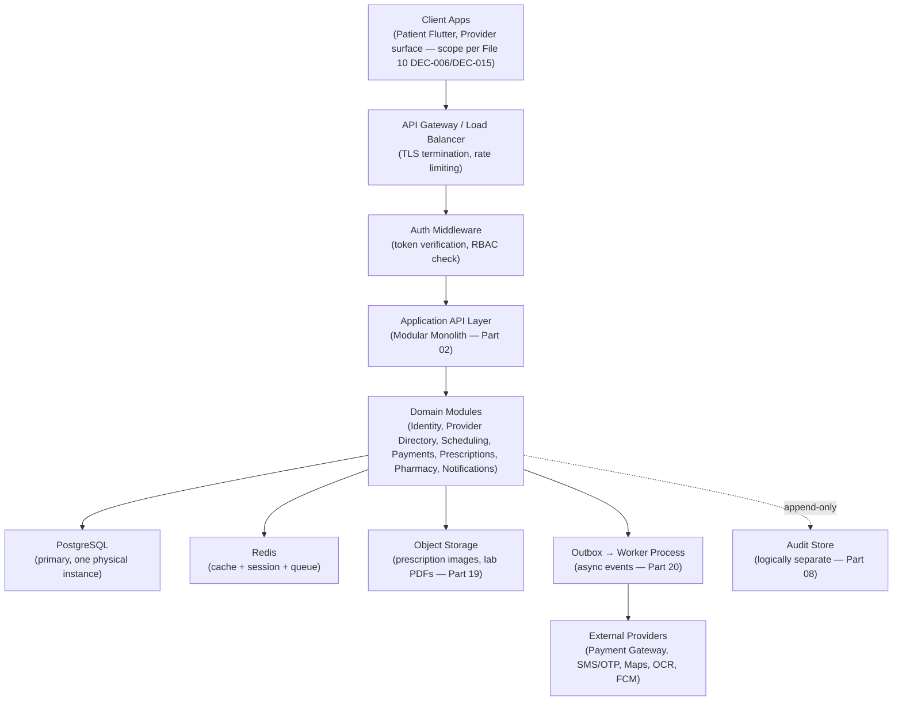
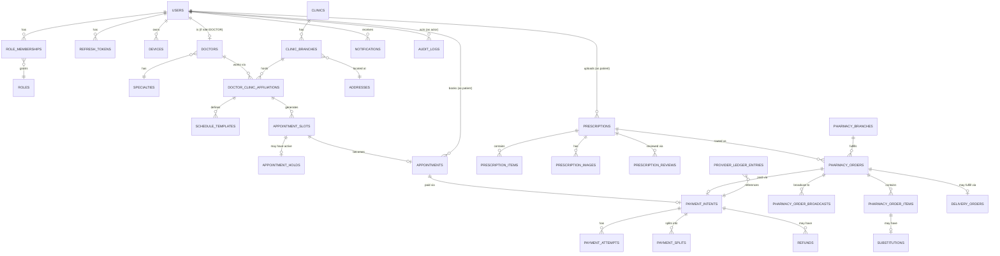
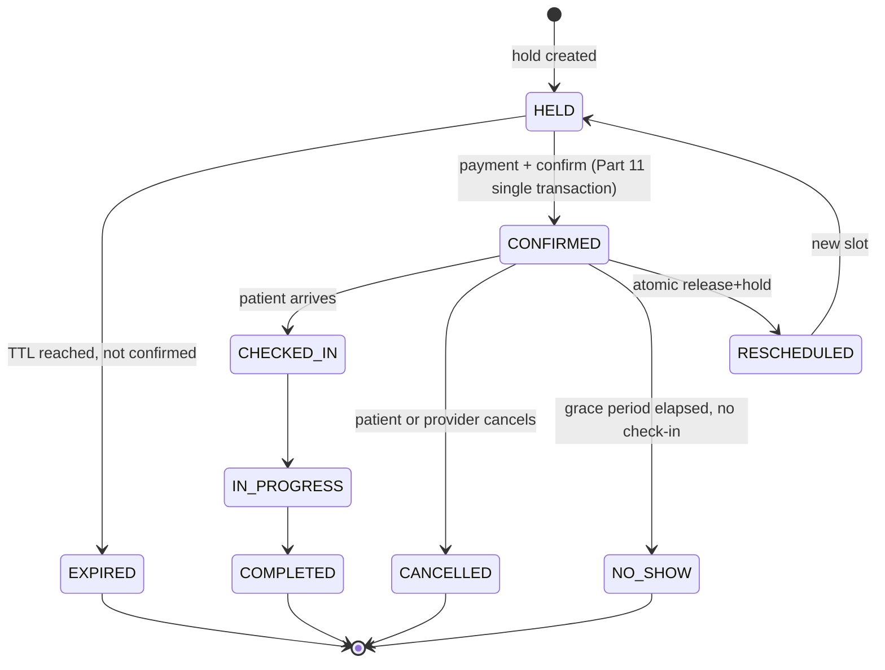
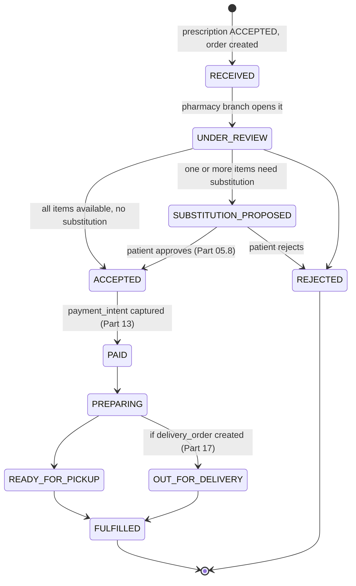

 FILE 11 — Backend / API & Database Engineering Specification
**Version:** v1.0
**Depends on:** `Healthcare-Super-Platform-Discovery-Document.md` · `MedSuper-SRS-Enterprise-Blueprint.md` · `MedSuper_Flutter_Architecture.md` · `FILE_10_Implementation_Readiness_Open_Decisions.md`
**Convention used throughout:** `REF` = already defined upstream, cited by section, not repeated. `OPEN DECISION` / `CONTRADICTION` / `ENGINEERING RISK` / `POSTPONE` are used exactly as instructed — never silently.

---

## PART 01 — BACKEND EXECUTIVE SUMMARY

**Purpose:** the backend is the single source of truth for every state transition described in File 10/SRS — no client (Patient Flutter app, Provider surface, future Web dashboard) is ever trusted to compute a price, a fee, or a permission; it only trusts what this system returns.

**Main actors:** Patient, Doctor, Clinic Staff (front-desk / clinic admin), Pharmacy Staff, Platform Admin. (Lab Staff exists in the data model but is dormant until Lab ships — File 10 §1.)

**Main modules (MVP):** Identity & Auth, Provider Directory, Scheduling/Appointments, Payments (ledger, pay-at-clinic first), Prescriptions, Pharmacy Fulfillment, Notifications (transactional tier), Audit. **Dormant/Phase 2+:** Laboratory, Delivery (beyond pickup-first tracking), Reviews, Fraud automation, Analytics warehouse, Family Accounts.

**Core workflows:** Search → Hold → Confirm (+pay) → Complete/Cancel; Upload Prescription → Pharmacist Review → Quote → Patient Approval → Fulfillment. Both workflows share one payment ledger (SRS §0; File 10 §5).

**Data ownership:** each domain module owns its tables exclusively — no module reaches into another module's tables directly, even though (per Part 02) they currently live in one physical database. Cross-module reads happen through an internal service call, not a join across module boundaries, so the boundary survives a future extraction into a real microservice.

**External integrations:** Payment gateway (File 10 §4/§5, provider = `OPEN DECISION` DEC-001), Maps/Geocoding (File 10 §4), SMS/OTP (File 10 §4), Object storage (File 10 §4/Part 19), OCR — assist-only (File 10 §7).

**Security boundaries:** PHI-bearing tables (encounters, prescriptions, lab data) sit behind stricter service-level authorization than PII-only tables (users, addresses) — detailed in Part 23. Audit logging is mandatory on every PHI read, not just write (File 10 §2.2 already established this for writes; this document extends it to reads in Part 23).

**Scalability expectations for MVP:** single-region (Egypt launch, per File 10 §5.2), low-hundreds of requests/second peak, not a distributed-scale problem yet — this fact directly drives the Part 02 architecture decision below.



---

## PART 02 — BACKEND ARCHITECTURE

### 02.1 Decision: Modular Monolith (with two auxiliary processes), not Microservices

**CONTRADICTION** flagged against the SRS's own framing: SRS §28 describes "15 microservices, each owning its own database." Evaluated against the actual criteria this document is required to weigh:

| Criterion | Assessment | Points toward |
|---|---|---|
| MVP complexity | Single-market, single-currency, ~8 MVP domain modules (Part 03) | Monolith |
| Team size | This is an agency-scale build, not a 50-engineer org (no team-size figure exists in any source doc, but nothing suggests otherwise) | Monolith |
| Development speed | 15 independently-deployed services means 15x the CI/CD, versioning, and integration-testing overhead before a single booking can be tested end-to-end | Monolith |
| Operational complexity | File 10 §12 already scored Infrastructure at 20% and Testing at 10% — adding distributed-systems operational load (service discovery, inter-service auth, distributed tracing) on top of a team that doesn't yet have basic CI/CD is compounding the weakest area, not the strongest | Monolith |
| Healthcare data sensitivity | Argues for **one thing done well** — a single, tightly-audited data boundary for PHI — not for spreading PHI access across 15 network-exposed services, each a new attack surface | Monolith (with the one exception below) |
| Scalability | At MVP traffic (Part 01), a modular monolith scales horizontally by running more identical stateless instances behind the load balancer — this covers 1–2 orders of magnitude of growth before it's a real constraint | Monolith |
| Future extraction | The module boundaries defined in Part 03 are designed so each one *could* become a real service later without a rewrite — this is what "modular" is doing here, it's not a rejection of the SRS's long-term shape, just a sequencing correction | Monolith now, services later |

**Recommendation:** one modular monolith application (internal module boundaries strictly enforced — no cross-module table joins, communication only through defined internal interfaces) **plus two auxiliary processes**: (1) a background **worker process** for async jobs (Part 20), (2) a logically/physically separate **audit store** (File 10 §3.3 already recommended this for retention-survival reasons independent of the monolith-vs-microservices question). This is a **Hybrid**, correctly weighted toward simplicity now.

**What this changes vs. the SRS:** nothing about the domain boundaries themselves (Part 03 below reuses the SRS's 15-service *names* as module names) — only the deployment topology. The SRS's service list becomes this document's module list.

### 02.2 Application layers

`API Layer (routing, request validation, auth middleware) → Application/Use-Case Layer (orchestrates domain logic, transaction boundaries) → Domain Layer (business rules, state machines) → Data Access Layer (repositories) → PostgreSQL/Redis/Object Storage`. Dependency direction is strictly downward — Domain layer never imports from API layer, mirroring the same discipline the Flutter Architecture doc applies client-side (consistency across the stack is deliberate, not incidental).

### 02.3 Cross-cutting concerns
Auth/RBAC middleware, correlation-ID propagation, structured logging, error-envelope normalization, idempotency-key handling — all implemented once, centrally, applied to every module — never reimplemented per module (this is the backend mirror of the Flutter doc's `core/` layer).

---

## PART 03 — DOMAIN MODULES

Format: **Module** — MVP/POSTPONE — one-line purpose, key entities (REF Part 09 for full schema), key business rules, key dependency, primary event(s) emitted.

| Module | Status | Purpose | Key entities | Critical business rule | Depends on | Emits |
|---|:---:|---|---|---|---|---|
| Identity & Auth | **MVP** | Phone-OTP auth, session/token lifecycle, role membership | `users`, `role_memberships`, `otp_requests`, `refresh_tokens`, `devices` | One `role_membership` active context at a time per File 10 DEC-006 resolution (Part 07) | none (foundation) | `UserRegistered`, `UserLoggedIn` |
| Provider Directory | **MVP** | Doctor/Clinic/Pharmacy directory, verification | `doctors`, `clinics`, `clinic_branches`, `doctor_clinic_affiliations`, `pharmacies`, `pharmacy_branches`, `specialties`, `addresses`, `provider_verification_documents` | A provider is invisible in search until `status = VERIFIED` (manual review, File 10 Part 1) | Identity (verifier is an Admin user) | `ProviderVerified` |
| Scheduling/Appointments | **MVP** | Availability, holds, booking lifecycle | `schedule_templates`, `appointment_slots`, `appointment_holds`, `appointments` | Partial unique index enforces one active hold per slot (File 10 §3.5, Part 11 below) | Provider Directory | `AppointmentHeld`, `AppointmentConfirmed`, `AppointmentCancelled`, `AppointmentCompleted` |
| Encounter/EMR | **POSTPONE** (Phase 2, File 10 Part 1) | Clinical visit notes | `health_records`, `encounters` | Reviews cannot exist without a completed encounter — this dependency is why Reviews is also postponed | Appointments | `EncounterCompleted` |
| Prescription | **MVP** (patient-uploaded only; doctor-issued POSTPONE) | Prescription capture, quality check, pharmacist review | `prescriptions`, `prescription_items`, `prescription_images`, `prescription_reviews` (new — Part 09) | No `prescription_item.drug_code` is trusted without human confirmation (File 10 §7.3) | Identity | `PrescriptionUploaded`, `PrescriptionAccepted`, `PrescriptionRejected` |
| Pharmacy Fulfillment | **MVP** | Quote, substitution, order lifecycle | `pharmacy_orders`, `pharmacy_order_items`, `pharmacy_order_broadcasts`, `substitutions` (new — Part 09) | First-accept-wins on broadcast orders via optimistic lock (File 10 §3.5) | Prescription, Provider Directory | `PharmacyOrderCreated`, `PharmacyOrderAccepted`, `SubstitutionProposed` |
| Payments | **MVP** (pay-at-clinic; online = fast-follow per File 10 §1.3) | PaymentIntent ledger, splits, refunds | `payment_intents`, `payment_attempts` (new), `payment_splits`, `refunds`, `provider_ledger_entries`, `webhook_events`, `settlements` (renamed from `payout_batches` — Part 09) | Commission rate is snapshotted at capture time, never recomputed retroactively (File 10 §5.1) | Appointments, Pharmacy Fulfillment | `PaymentCaptured`, `PaymentFailed`, `RefundIssued` |
| Notifications | **MVP** (transactional + informational tiers only) | Multi-channel delivery per SRS 4-tier model | `notifications`, `notification_preferences` | `SAFETY_CRITICAL` cannot be user-disabled (File 10 §11 business rule) | all modules (consumer of events) | `NotificationSent` |
| Delivery | **MVP-lite** (pickup-first tracking only; courier assignment = POSTPONE, File 10 §6.5) | Track pharmacy-arranged delivery | `delivery_orders` | No `delivery_order` is created before its `pharmacy_order` reaches `PREPARING`+ (File 10 §6.4) | Pharmacy Fulfillment | `DeliveryStatusChanged` |
| Audit | **MVP** | Append-only compliance log | `audit_logs` | Written in the *same* transaction as the business action, never async-only (File 10 §2.2) | all modules | none (terminal sink) |
| Laboratory | **POSTPONE** (Phase 3, File 10 §1) | — | — | — | — | — |
| Reviews | **POSTPONE** (Phase 2) | — | — | — | — | — |
| Fraud/Risk (automated) | **POSTPONE** (Phase 2) | — | — | — | — | — |
| Analytics | **POSTPONE** (Phase 3) | — | — | — | — | — |
| Admin/Policy Config | **MVP** (minimal) | Commission rate, cancellation tiers as data | `policy_configs` | Rate/tier changes apply to *new* transactions only, never retroactively | Identity (admin role) | `PolicyConfigChanged` |

---

## PART 04 — API ARCHITECTURE

Base conventions are **REF File 10 §2.2** (versioning `/v1`, error envelope shape, cursor pagination, idempotency keys, correlation IDs, ISO-8601 UTC timestamps) — extended here with what File 10 didn't cover:

| Concern | Rule |
|---|---|
| Base URL | `https://api.medsuper.app/v1/...` (placeholder domain — actual domain is an infra decision, not an engineering one) |
| Filtering | Explicit whitelisted query params per endpoint (`?specialty=...&status=...`) — no generic filter DSL for MVP |
| Sorting | `?sort=field:asc|desc`, one field at a time for MVP, whitelisted per endpoint |
| Search | Delegated to Part 22 |
| Rate limiting | Token-bucket per authenticated user (or per-IP for unauthenticated endpoints like `/otp/request`), limits defined per-endpoint in Part 05, headers `X-RateLimit-Remaining`/`X-RateLimit-Reset` |
| Caching (HTTP layer) | `Cache-Control` headers on genuinely cacheable public GETs only (specialties list, public doctor profile) — never on anything behind auth returning PHI |
| File upload | `multipart/form-data`, direct-to-API upload for MVP (not client-direct-to-S3 presigned upload — simpler for MVP, revisit if upload volume/size becomes a bottleneck), size/MIME validated at the API layer before touching storage |
| Large payload handling | Request body cap (e.g., 15MB) enforced at the gateway layer, before it reaches application code — prevents a malformed/huge request from consuming a worker thread |
| API deprecation | A deprecated endpoint returns a `Deprecation` header + `Sunset` date header for at least one full release cycle before removal; version bump (`/v2`) only for breaking changes, additive changes never bump version |
| HTTP status conventions | `200` success/read, `201` resource created, `204` success/no-body, `400` validation, `401` unauthenticated, `403` unauthorized, `404` not found, `409` conflict (double-hold, idempotency-key reuse), `422` business-rule rejection (distinct from `400` — a syntactically valid request that violates a business rule, e.g., cancelling an already-completed appointment), `429` rate limited, `5xx` genuine server fault only |
| Timezone handling | Every table storing a point in time uses `timestamptz` (Part 08); the API always returns UTC ISO-8601; **the one place local time matters** is displaying a clinic's working hours, which is why `clinic_branches` needs an IANA timezone column (Part 09) — the API returns both the UTC instant and the branch's timezone so the client renders correctly without guessing |

---

## PART 05 — API CONTRACT

**Scope note:** per instruction, Laboratory and Reviews endpoints are marked **FUTURE** with a one-line placeholder only — full contracts will be produced when those modules are scheduled (File 10 §1). Everything below is either **REF** (already fully specified in File 10 §2.3, cited not repeated) or **NEW** (specified here for the first time).

### 05.1 Authentication

| Endpoint | Status |
|---|---|
| `POST /v1/auth/otp/request` | REF File 10 §2.3 |
| `POST /v1/auth/otp/verify` | REF File 10 §2.3 |

**`POST /v1/auth/token/refresh`** — NEW
- **Actor:** any authenticated user (via refresh token, not access token) · **Auth:** refresh token in body, not header (access token is expired/expiring, that's the point of this call)
- **Request:** `{ "refreshToken": "..." }`
- **Business rule:** token rotation — the old refresh token is invalidated the instant a new one is issued (`refresh_tokens.rotated_from_token_id` chain, Part 09); reusing an already-rotated refresh token is treated as a **theft signal**: the entire token family is revoked and the user is forced to re-authenticate (**ENGINEERING RISK** if this is skipped — silent non-rotation is a well-known refresh-token replay vulnerability)
- **Response `200`:** `{ "accessToken": "...", "refreshToken": "...", "expiresIn": 3600 }`
- **Errors:** `401 INVALID_REFRESH_TOKEN`, `401 TOKEN_FAMILY_REVOKED`
- **Rate limit:** per user, generous but capped
- **Audit:** security log, not full audit_log (no PHI involved)

**`POST /v1/auth/logout`** — NEW
- **Request:** `{ "refreshToken": "...", "allDevices": false }`
- **Response `204`.** `allDevices: true` revokes every refresh token for the user (device-management "log out everywhere" — SRS mentions device management as a requirement)

### 05.2 Patient

**`GET /v1/patients/me`** — NEW · **Auth:** required, role=PATIENT · **Response `200`:** profile fields (name, DOB, phone, addresses) — **never** returns other patients' data regardless of any query manipulation (enforced by deriving the id from the token, never accepting a patient id as a path/query param on this route)

**`PATCH /v1/patients/me`** — NEW · same auth · partial update, validated field-by-field (e.g., phone-number changes re-trigger OTP verification, not a silent PATCH)

### 05.3 Doctor / Clinic (provider-facing)

**`GET /v1/doctors/{doctorId}`** — NEW · public · full profile for the Doctor Details screen (File 10 Part 8.1)

**`PATCH /v1/doctors/{doctorId}/schedule-template`** — NEW · **Auth:** DOCTOR role, must be the doctor themself or clinic admin managing them · updates `schedule_templates`; does **not** retroactively touch already-generated `appointment_slots` — a template change affects the *next* slot-generation job run only (explicit business rule, prevents a schedule edit from silently invalidating slots patients already hold)

**`GET /v1/clinic-branches/{branchId}/appointments`** — NEW · **Auth:** CLINIC_STAFF scoped to that branch · this is the Clinic Dashboard queue (File 10 Part 8.1) · query params: `date`, `status`

**`POST /v1/appointments/{appointmentId}/accept`** / **`/reject`** / **`/reschedule`** — NEW · **Auth:** CLINIC_STAFF with `appointment:manage` permission (Part 07) scoped to the branch · reject/reschedule requires a `reason`; accept has no body

### 05.4 Search / Availability

| Endpoint | Status |
|---|---|
| `GET /v1/doctors/search` | REF File 10 §2.3 |
| `GET /v1/doctors/{doctorId}/slots` | REF File 10 §2.3 |

### 05.5 Appointments

| Endpoint | Status |
|---|---|
| `POST /v1/appointments/hold` | REF File 10 §2.3 |
| `POST /v1/appointments/{holdId}/confirm` | REF File 10 §2.3 |
| `POST /v1/appointments/{appointmentId}/cancel` | REF File 10 §2.3 |

**`GET /v1/appointments/{appointmentId}`** — NEW · **Auth:** the owning patient, or clinic staff of the associated branch, or the doctor · returns full detail incl. status history

**`GET /v1/appointments`** — NEW (list, "My Appointments" screen) · **Auth:** required · query: `status`, `from`/`to`, cursor pagination · scoped automatically to the caller's own appointments (patient) or branch (clinic staff) — never a global list without an explicit Admin-only variant

**`POST /v1/appointments/{appointmentId}/reschedule`** — NEW · **Request:** `{ "newSlotId": "uuid" }` · internally: atomically release the old slot and hold the new one in one transaction (Part 11) · same 5-minute-hold semantics apply to the new slot

### 05.6 Payments

**`POST /v1/payment-intents`** — NEW (File 10 flagged this as "still required"; specified now)
- **Auth:** required · **Request:** `{ "payableType": "APPOINTMENT"|"PHARMACY_ORDER", "payableId": "uuid", "method": "PAY_AT_CLINIC"|"ONLINE" }` · `Idempotency-Key` required
- **Business rule:** for `PAY_AT_CLINIC`, `status` moves straight to a captured-equivalent state (File 10 §5.1) and a `provider_ledger_entries` row is written in the same transaction; for `ONLINE`, **OPEN DECISION DEC-001** (gateway) blocks completing this contract's gateway-redirect fields until resolved — the intent-creation half of this endpoint is buildable now, the online-capture half is not
- **Response `201`:** `{ "paymentIntentId": "uuid", "status": "CREATED"|"CAPTURED", "gatewayRedirectUrl": "nullable — populated once DEC-001 resolved" }`

| Endpoint | Status |
|---|---|
| `POST /v1/webhooks/payments/{provider}` | REF File 10 §2.3 |

**`POST /v1/payment-intents/{id}/refund`** — NEW · **Auth:** CLINIC_STAFF/PHARMACY_STAFF/ADMIN depending on `payableType`, or system-triggered on `AppointmentCancelled` event · `{ "amount": "nullable — full if omitted", "reason": "..." }` · idempotency required (a double-tapped refund button must not double-refund)

### 05.7 Prescriptions

| Endpoint | Status |
|---|---|
| `POST /v1/prescriptions/upload` | REF File 10 §2.3 |

**`GET /v1/prescriptions/{prescriptionId}`** — NEW · **Auth:** owning patient, or pharmacy staff **only once routed to their branch** (never before — File 10 §7.3 access-control principle), or Admin

**`POST /v1/prescriptions/{prescriptionId}/review`** — NEW · **Auth:** PHARMACY_STAFF with an attached license number on their profile (Part 07) · **Request:** `{ "decision": "ACCEPTED"|"REJECTED"|"NEEDS_CLARIFICATION", "reasonCode": "...", "confirmedItems": [ { "prescriptionItemId", "drugCode", "controlledSubstanceConfirmed": bool } ] }` · writes to the new `prescription_reviews` table (Part 09) — this is the endpoint that closes File 10 §7.3's identified gap · **business rule:** any item where the underlying `drug_catalog.controlled_substance = true` requires `controlledSubstanceConfirmed = true` explicitly in the payload, or the whole request is rejected with `422 CONTROLLED_SUBSTANCE_CONFIRMATION_REQUIRED` — this is DEC-016's hard-block made concrete at the API layer

### 05.8 Pharmacy

| Endpoint | Status |
|---|---|
| `POST /v1/pharmacy-orders/{orderId}/quote` | REF File 10 §2.3 |

**`POST /v1/pharmacy-orders/{orderId}/approve`** — NEW (patient side) · **Auth:** owning patient · this call is what creates the `payment_intents` row (File 10 Part 8.1's explicit business rule — approval and payment-intent-creation are the same moment, not decoupled)

**`GET /v1/pharmacy-orders/{orderId}`** — NEW · **Auth:** owning patient or the assigned pharmacy branch staff

**`GET /v1/pharmacy-branches/{branchId}/orders`** — NEW (pharmacy inbox) · **Auth:** PHARMACY_STAFF scoped to branch · query: `status`

### 05.9 Notifications

**`GET /v1/notifications`** — NEW · **Auth:** required, self-scoped · cursor pagination, `?unreadOnly=true` filter

**`PATCH /v1/notifications/{id}/read`** — NEW · **Auth:** required, self-scoped

### 05.10 Medical Records (MVP-lite only — full timeline is POSTPONE per File 10 Part 1)

**`GET /v1/patients/me/health-record/summary`** — NEW · returns a flat list of past appointments + accepted prescriptions, **not** the "unified clinical timeline" concept from SRS §0 (that requires Encounter/EMR, which is Phase 2) — naming this endpoint `/summary` deliberately, so nobody mistakes it for the full future feature

### 05.11 Laboratory — **FUTURE**
Full contract set deferred to the Phase 3 Laboratory specification (File 10 §1). Placeholder module exists in Part 03 for data-model forward-compatibility only.

### 05.12 Reviews — **FUTURE**
Deferred to Phase 2 (File 10 §1.2 / DEC-017). No contract specified here.

---

## PART 06 — STANDARD API ERROR MODEL

Envelope — **REF File 10 §2.2**, restated once for completeness since this is a dedicated section:
```json
{
  "success": false,
  "error": {
    "code": "APPOINTMENT_SLOT_UNAVAILABLE",
    "message": "This slot is no longer available.",
    "details": {},
    "requestId": "uuid",
    "correlationId": "uuid"
  }
}
```

| Category | HTTP | Example codes |
|---|---|---|
| Authentication | 401 | `UNAUTHENTICATED`, `TOKEN_EXPIRED`, `INVALID_REFRESH_TOKEN` |
| Authorization | 403 | `FORBIDDEN`, `ROLE_NOT_PERMITTED`, `RESOURCE_NOT_OWNED` |
| Validation | 400 | `VALIDATION_ERROR` (with `details.fields[]`) |
| Conflict | 409 | `SLOT_ALREADY_HELD`, `SLOT_ALREADY_BOOKED`, `IDEMPOTENCY_KEY_REUSE`, `ORDER_ALREADY_CLAIMED` |
| Not found | 404 | `RESOURCE_NOT_FOUND` |
| Rate limit | 429 | `RATE_LIMITED` |
| Business rule | 422 | `HOLD_EXPIRED`, `CANCELLATION_WINDOW_PASSED`, `CONTROLLED_SUBSTANCE_CONFIRMATION_REQUIRED` |
| Payment | 402/422 | `PAYMENT_REQUIRED`, `PAYMENT_DECLINED`, `REFUND_FAILED` |
| File | 400/413 | `INVALID_FILE_TYPE`, `FILE_TOO_LARGE`, `QUALITY_CHECK_FAILED` |
| External provider | 502/503 | `GATEWAY_UNAVAILABLE`, `SMS_PROVIDER_ERROR` — message is generic to the client; the real vendor error is only in server-side logs (never leak vendor internals to the client) |
| Internal | 500 | `INTERNAL_ERROR` — message is always the same generic string in production; stack traces never leave the server |

**Hard rule:** no error response, at any code, ever includes a raw database error message, a stack trace, or an internal file path — the `ErrorInterceptor` (mirroring the Flutter client's own §6) is the single place this is enforced, so no individual route handler can accidentally leak it.

---

## PART 07 — AUTHENTICATION & AUTHORIZATION

### 07.1 Backend auth architecture
Registration/Login unified via OTP (File 10 §2.3) — no separate password flow for Patients (matches Discovery Doc's phone-first market reality). **Provider staff** (Doctor/Clinic/Pharmacy) additionally require Admin-approved `role_memberships` before their OTP-verified account gains any provider permission — an OTP-verified phone number alone never grants provider access.

- **Access tokens:** short-lived JWT (e.g., 15–60 min — exact value is an `OPEN DECISION`, not a business-critical one), carrying `userId` + active `role_membership` context (resolving File 10 DEC-006 — the token's role claim is chosen per active session context, not baked into one binary).
- **Refresh tokens:** long-lived, opaque (not JWT), stored hashed, rotated on every use (05.1).
- **MFA:** not required for Patient (would add friction to a phone-first market with no evidence it's needed); **required for Admin** (Part 23) given the blast radius of that role.
- **Account lockout:** progressive OTP-attempt lockout (File 10 §2.3's `otp_requests.attempts`), not a permanent ban — a temporary cooldown.
- **Impersonation:** **not supported** in MVP — if Support needs to see what a user sees for debugging, they use read access to that user's data via their own Admin audit-logged session, never literally logging in *as* the user. (Not addressed in any source document — noted here as a deliberate absence, not an oversight.)

### 07.2 Authorization matrix (excerpt — the rows that matter most)

| Role | Resource | Action | Allowed |
|---|---|---|---|
| Patient | Own Appointment | Create/Cancel/Reschedule | YES |
| Patient | Another Patient's Appointment | Read | NO |
| Patient | Own Prescription | Create/Read | YES |
| Patient | Own Prescription | Review/Accept/Reject | NO (pharmacist-only action) |
| Doctor | Own Schedule Template | Update | YES |
| Doctor | Own Today's Appointments | Read | YES |
| Doctor | Patient's Full Health Record | Read | **Conditional** — only patients with an existing/past appointment with that doctor (SRS §17 "least privilege" principle), enforced by a join through `appointments`/`encounters`, not a blanket Doctor→Patient grant |
| Clinic Staff (front-desk) | Branch Appointments | Accept/Reject/Reschedule | YES, scoped to own branch only |
| Clinic Staff (front-desk) | Branch Financial Settlement | Read | NO — clinic-admin-tier permission, not front-desk |
| Clinic Admin | Branch Financial Settlement | Read | YES |
| Pharmacy Staff | Prescription | Read | **Conditional** — only after the prescription is routed/broadcast to their branch, and non-sensitive fields only until they formally open it (File 10 §7.3 masking principle carries through to authorization, not just UI) |
| Pharmacy Staff | Prescription | Approve/Reject | YES, only if licensed (license number on their `role_membership` profile, checked at `POST /prescriptions/{id}/review`) |
| Admin | Audit Log | Read | YES |
| Admin | Any user's PHI | Read | YES, but **every such read is itself audit-logged with a mandatory reason code** — Admin's broad access is the highest-risk grant in the system and gets the most logging, not the least |
| Admin | Policy Config | Update | YES |
| Anyone | Own Audit Log entries about themselves | Read | **OPEN DECISION** — not addressed in any source doc; likely required by regional data-protection law (subject access request), flagged for legal review alongside File 10 DEC-009/DEC-014 |

### 07.3 Provider verification & admin access
Provider verification is a state transition (`PENDING → VERIFIED`/`REJECTED`) performed only by Admin, always audit-logged with the reviewed document reference (File 10 §3.3 `provider_verification_documents.reviewed_by`). Admin accounts are provisioned manually (no self-service Admin signup exists anywhere in this system, by design).

---

## PART 08 — DATABASE ARCHITECTURE

Engine: **PostgreSQL** — **REF File 10 §3.1**, unchanged.

| Principle | Rule |
|---|---|
| Schema organization | One physical database for MVP (per Part 02's monolith decision); tables grouped by module via naming prefix convention (below), **not** literal Postgres schemas per module for MVP — simpler operationally, still logically organized. Revisit real schema-per-module (or database-per-service) only if/when a module is actually extracted. |
| Naming convention | `snake_case`, singular-domain/plural-table (`appointments`, not `appointment`); FK columns named `<referenced_table_singular>_id` (`patient_id`, not `patientId` or just `patient`); enums as Postgres native `enum` types, named `<table>_<column>_enum` |
| Primary key strategy | UUID (v7 preferred where the driver supports it) — **REF File 10 §3.2** |
| Isolation levels | `READ COMMITTED` (Postgres default) for general reads/writes; the appointment-hold and pharmacy-broadcast-accept paths specifically use explicit row-level locking (`SELECT ... FOR UPDATE`) or rely on the optimistic-lock `version` column + unique constraints (Part 11) rather than escalating to `SERIALIZABLE` globally, which would hurt throughput everywhere to protect a narrow code path |
| Optimistic locking | `version integer` on every stateful table — **REF File 10 §3.2** |
| Soft deletion | `deleted_at timestamptz null` on real-world entities — **REF File 10 §3.2** |
| Audit fields | `created_at`/`updated_at` on every table — **REF File 10 §3.2** |
| Timezone strategy | All timestamps `timestamptz`, stored/queried in UTC; `clinic_branches`/`pharmacy_branches`/`lab_branches` carry an explicit `iana_timezone` column for local-hours display (Part 09) |
| Data retention | PHI-adjacent tables: 6–7 years minimum (SRS §25) — enforced by **never hard-deleting**, only soft-deleting, plus a scheduled archival job (Phase 2, not MVP) that moves old soft-deleted rows to cold storage rather than a DB-level TTL |
| Partitioning | `audit_logs` and `notifications` are the two tables likely to need time-based partitioning first — **POSTPONE**, not needed at MVP volume, but table design (append-only, indexed on `occurred_at`/`created_at`) doesn't block adding it later |
| Read replicas | **POSTPONE** — no MVP read load justifies this yet; the caching layer (Part 21) is the correct first lever, not replication |
| Backup/restore/migration strategy | Part 25/27 |

---

## PART 09 — DATABASE SCHEMA SPECIFICATION

### 09.1 Terminology reconciliation (this prompt's naming vs. File 10's naming — same entities, one name each, going forward)

| This prompt's term | Canonical table (File 10) | Note |
|---|---|---|
| `medical_records` | `health_records` + `encounters` | Two tables, not one — File 10's split is kept |
| `doctor_clinic_relationships` | `doctor_clinic_affiliations` | Same table |
| `availability` | `schedule_templates` | Same table |
| `appointment_slots` | `slots` | **Renamed to `appointment_slots`** here for clarity against `appointment_holds`/`appointments` — adopt this name going forward |
| `settlements` | `payout_batches` | **Renamed to `settlements`** — clearer for a finance audience; adopt going forward |
| `payments` (generic) | `payment_intents` | No separate generic `payments` table — the intent *is* the payment record, per File 10 §5's ledger design |

### 09.2 Tables already fully specified — no change

**REF File 10 §3.3, unchanged:** `users`, `role_memberships`, `roles`, `permissions`, `role_permissions`, `otp_requests`, `devices`, `specialties`, `addresses`, `doctors`, `clinics`, `clinic_branches`, `doctor_clinic_affiliations`, `pharmacies`, `pharmacy_branches`, `provider_verification_documents`, `schedule_templates` (now referred to as `availability` conceptually), `appointment_slots` (formerly `slots`), `appointment_holds`, `appointments`, `health_records`, `encounters`, `consents`, `drug_catalog`, `prescriptions`, `prescription_items`, `prescription_images`, `pharmacy_orders`, `pharmacy_order_broadcasts`, `pharmacy_order_items`, `payment_intents`, `payment_splits`, `refunds`, `provider_ledger_entries`, `webhook_events`, `notifications`, `notification_preferences`, `reviews` (schema defined, feature POSTPONE), `audit_logs`, `fraud_flags` (schema defined, feature POSTPONE), `delivery_orders`, `policy_configs`.

Two column additions to existing tables, both minor and additive (no migration risk to already-agreed structure):
- `refresh_tokens.rotated_from_token_id uuid null` — supports the theft-detection chain in Part 05.1/07.1.
- `clinic_branches.iana_timezone text not null`, `pharmacy_branches.iana_timezone text not null` — supports Part 04/08 timezone handling. (`laboratories`/`lab_branches` get the same column when Lab is built.)

### 09.3 New tables (genuinely new — not in File 10)

**`payment_attempts`**
| Column | Type | Null | Notes |
|---|---|---|---|
| `id` | uuid | PK | |
| `payment_intent_id` | uuid | FK → payment_intents | |
| `gateway_reference` | text | nullable | populated once DEC-001 resolved |
| `status` | enum(`INITIATED`,`SUCCEEDED`,`FAILED`) | not null | |
| `failure_code` | text | nullable | raw gateway decline code, never shown to client verbatim (Part 06) |
| `attempted_at` | timestamptz | not null | |

*Purpose:* a single `payment_intent` can have multiple attempts (card declined, retried) — separating attempts from the intent keeps the intent's own state machine (File 10 §5.1) clean and gives Support a real retry history without overloading `payment_intents` with attempt-level noise.

**`substitutions`**
| Column | Type | Null | Notes |
|---|---|---|---|
| `id` | uuid | PK | |
| `pharmacy_order_item_id` | uuid | FK → pharmacy_order_items | |
| `original_drug_code` | text | FK → drug_catalog | |
| `substituted_drug_code` | text | FK → drug_catalog | |
| `proposed_by_user_id` | uuid | FK → users (pharmacist) | |
| `proposed_at` | timestamptz | not null | |
| `patient_decision` | enum(`PENDING`,`APPROVED`,`REJECTED`) | not null default `PENDING` | |
| `decided_at` | timestamptz | nullable | |

*Purpose:* File 10 modeled substitution as a status on `pharmacy_order_items`; this table adds the explicit audit trail (who proposed what, when, patient's decision, when) — a genuine compliance need for anything touching what medication a patient actually receives, not a redundant duplicate.

**`prescription_reviews`**
| Column | Type | Null | Notes |
|---|---|---|---|
| `id` | uuid | PK | |
| `prescription_id` | uuid | FK → prescriptions | |
| `pharmacist_user_id` | uuid | FK → users | |
| `decision` | enum(`ACCEPTED`,`REJECTED`,`NEEDS_CLARIFICATION`) | not null | |
| `reason_code` | text | nullable | |
| `controlled_substance_confirmed` | boolean | not null default false | |
| `reviewed_at` | timestamptz | not null | |

*Purpose:* closes the gap File 10 §7.3 explicitly flagged — a durable record of which licensed pharmacist made which clinical-adjacent decision, required for the `POST /prescriptions/{id}/review` endpoint (Part 05.7) and for any future dispute/audit.

**Deferred structure (defined now for forward-compatibility, not built — POSTPONE, Phase 2):** `inventory (pharmacy_branch_id, drug_code, quantity, updated_at)`, `inventory_movements (id, inventory_id, delta, reason, related_pharmacy_order_id, created_at)`. MVP pharmacy flow uses pharmacist-declared per-order availability (File 10 §3.3 already noted this is "optional MVP-lite") — a real inventory ledger is not required until self-service stock sync is prioritized.

### 09.4 Sensitive-field / encryption map (new — consolidates what was scattered across File 10)

| Table | Sensitive column(s) | Classification | Requirement |
|---|---|---|---|
| `encounters` | `notes_encrypted` | PHI | Application-layer encryption (not just disk-level) |
| `prescription_images` | `file_url` (points to object storage) | PHI | Bucket-level encryption + restricted IAM (Part 19) |
| `users` | `phone`, `email` | PII | Disk-level encryption sufficient; access-logged on Admin reads |
| `payment_intents`/`payment_attempts` | none — no card data ever stored here | — | Gateway-hosted fields only (Part 13/23) |
| `audit_logs` | `source_ip` | PII | Retained per compliance need, access itself restricted to Admin |

---

## PART 10 — DATABASE RELATIONSHIPS (MVP ER Diagram)



**Most important relationships, explained:**
- `appointment_slots ||--o| appointment_holds` and `||--o| appointments` are both *optional* one-to-one from the slot's perspective at any given moment — a slot is `OPEN` (neither), `HELD` (has an active hold), or `BOOKED` (has an appointment) — never more than one simultaneously, which is exactly what the Part 11 locking strategy protects.
- `pharmacy_orders ||--o| payment_intents` and `appointments ||--o| payment_intents` both point at the **same** `payment_intents` table (polymorphic `payable_type`/`payable_id`, File 10 §5.1) — this diagram shows it as two relationships because Mermaid's ER syntax doesn't natively express polymorphic FKs, but it is one shared table, which is the entire point of Decision #4 (Flutter doc) / the shared-ledger principle (SRS §0).
- `pharmacy_order_items ||--o| substitutions` is optional — most order items are never substituted.

---

## PART 11 — TRANSACTIONAL INTEGRITY

| Workflow | Transaction boundary | Locking strategy | Idempotency | Conflict behavior | Retry | Failure recovery |
|---|---|---|---|---|---|---|
| Appointment hold | Single transaction: check slot `OPEN` + insert `appointment_holds` | Partial unique index `(slot_id) WHERE status='ACTIVE'` (File 10 §3.5) — DB-enforced, not app-checked-then-acted | `Idempotency-Key` header — repeat call with same key returns the same hold, doesn't create a second | `409 SLOT_ALREADY_HELD` on constraint violation | Client-side only (new hold attempt on a different slot) | A hold past `expires_at` is either reaped by a scheduled sweep job or lazily expired on next read — both must agree, or a slot can appear `HELD` forever (**ENGINEERING RISK** if only one path is implemented) |
| Concurrent slot booking (two patients, same slot) | Same as above — hold is the actual contention point, confirm is not (only the hold-owner can confirm) | Same partial unique index | Same | Second request fails at hold time, never reaches confirm | N/A | N/A |
| Payment confirmation | `appointments.status → CONFIRMED` and `payment_intents.status → CAPTURED` (or the pay-at-clinic equivalent) happen in **one transaction** — never confirm the appointment and leave payment pending as two separate commits | Row lock on the `appointments` row during the transition (`SELECT ... FOR UPDATE`) | `Idempotency-Key` on `/confirm` | Re-check hold not expired inside the same transaction (File 10 §3.5 point 3) | Client retries with the same idempotency key are safe no-ops | If the transaction fails partway, Postgres rolls back both changes together — this is exactly why they must be one transaction, not an orchestration across two calls |
| Payment webhook duplication | Insert into `webhook_events` with unique `idempotency_key` **before** any business-logic side effect executes | Unique constraint on `webhook_events.idempotency_key` | The constraint *is* the idempotency mechanism | Duplicate webhook → insert fails → handler exits early, no side effect runs twice | Gateway's own retry policy (outside our control) — our side is always safe regardless of how many times it retries | If processing the (successfully inserted) event throws mid-way, the event stays marked unprocessed and a worker retries it — separate from the gateway-level retry |
| Pharmacy broadcast accept (first-wins) | `pharmacy_orders.pharmacy_branch_id` assignment + `version` increment in one transaction | Optimistic lock: `UPDATE ... WHERE id=? AND version=? AND pharmacy_branch_id IS NULL` | Natural — the `WHERE` clause makes a duplicate accept a no-op update (0 rows affected) | App translates 0-rows-affected into `409 ORDER_ALREADY_CLAIMED` for the losing pharmacy | None needed — losing pharmacy simply sees the order disappear from their queue | N/A |
| Pharmacy substitution approval | `substitutions.patient_decision` update + (if approved) `pharmacy_order_items` price/status update, one transaction | Row lock on the order | `Idempotency-Key` on the approve call | A substitution already decided returns its existing decision, doesn't re-process | Safe retry | N/A |
| Pharmacy inventory deduction | **POSTPONE** (Part 03/09 — `inventory` table not built for MVP) | — | — | — | — | — |
| Lab scheduling | **POSTPONE** (Phase 3) | — | — | — | — | — |
| Delivery assignment | Single transaction: `delivery_orders` insert tied to a `pharmacy_order` already in `PREPARING`+ (File 10 §6.4) | Row lock on the pharmacy_order during creation to prevent two delivery_orders for one pharmacy_order | `Idempotency-Key` | Duplicate creation attempt returns existing delivery_order | Safe retry | N/A |
| Prescription submission | Single transaction: `prescriptions` + `prescription_images` rows inserted together, `status=UPLOADED` | None needed (no contention — one patient's own upload) | `Idempotency-Key` prevents a flaky-network double-submit from creating two prescriptions for one photo set | N/A | Client retry-safe | Failed image upload after DB row created → orphaned `UPLOADED` row with no image; a scheduled cleanup job (Part 20/27) reaps prescriptions stuck in `UPLOADED` beyond a timeout |
| Review creation | **POSTPONE** (Phase 2) | — | — | — | — | — |
| Wallet operations | **N/A** — no wallet in MVP or near-term roadmap (SRS Phase 4) | — | — | — | — | — |

---

## PART 12 — APPOINTMENT ENGINE

- **Availability/working hours/breaks:** `schedule_templates` per `doctor_clinic_affiliation`, weekday + start/end time + slot duration; a "break" is simply a gap not covered by any template row for that window — no separate break entity needed.
- **Buffer time:** `schedule_templates.buffer_minutes` (new field, not previously specified anywhere) — inserted between generated slots so back-to-back bookings don't assume zero transition time; defaults to 0, clinic-configurable.
- **Timezones:** slot generation job reads the branch's `iana_timezone` (Part 09.2) to convert local schedule-template hours into UTC `appointment_slots.start_at`/`end_at` — all storage/comparison in UTC, only display converts back.
- **Slot generation:** a scheduled job (Part 20/27) materializes `appointment_slots` rows on a rolling window (e.g., next 30 days) from `schedule_templates` — slots are real rows, not computed on-the-fly, because a real row is what the unique-index locking (Part 11) needs to exist against.
- **Hold → expiration:** `appointment_holds.expires_at = created_at + 5 minutes` (Flutter doc §4/File 10, kept consistent). A hold reaper (Part 20) both expires stale holds and releases the slot back to `OPEN`.
- **Booking/payment/confirmation:** Part 11's single-transaction rule.
- **Cancellation — patient-initiated:** fee computed server-side from `policy_configs` cancellation tiers against `now()` vs `appointments` start time (File 10 §2.3 business rule, restated as authoritative here per Contradiction #4 in File 10 Part 9). **Provider-initiated:** always full refund, no fee tier applies (File 10 §3.3 business rule).
- **Rescheduling:** modeled as atomic release-old + hold-new (Part 05.5/11), never a bare status field flip.
- **No-show:** a scheduled job transitions `CONFIRMED` appointments to `NO_SHOW` if no `CHECKED_IN` event occurred by (`start_at` + a grace period, e.g., 15 minutes — exact value `OPEN DECISION`, business call not engineering). No-show does **not** auto-refund (distinct from cancellation).
- **Completion:** clinic staff or doctor explicitly marks `IN_PROGRESS → COMPLETED` (not automatic) — this is the trigger `AppointmentCompleted` event that (eventually, Phase 2) unlocks Reviews.
- **Conflict resolution / concurrent booking:** Part 11.
- **Notifications:** `AppointmentConfirmed`/`Cancelled`/reminder events feed Part 18's tier routing.
- **Audit:** every state transition writes an `audit_logs` row with `action`, `resource_type='appointment'`, `resource_id`, `actor_user_id`.



---

## PART 13 — PAYMENT BACKEND

Architecture is **REF File 10 §5.1**, unchanged in principle; this section adds the `payment_attempts` layer (Part 09.3) and formalizes what File 10 left implicit.

- **PaymentIntent → PaymentAttempt → Payment:** an "intent" represents the obligation to pay; an "attempt" represents one try at a gateway; there is no separate "Payment" table — a **successful attempt** is what the intent's `status=CAPTURED` represents (Part 09.1 terminology reconciliation).
- **Settlement/Commission/Payout:** `payment_splits` (computed at capture) → aggregated into `settlements` (formerly `payout_batches`) on a schedule (Part 27 cron). Commission rate sourced from `policy_configs` **at capture time**, never recalculated later (File 10 §5.1).
- **Webhook:** Part 05.6/11 — signature-verified, idempotency-enforced.
- **Failure handling:** a `FAILED` `payment_attempts` row does not fail the `payment_intents` row — the intent stays `CREATED`/`AUTHORIZED` and the client may create a new attempt against the same intent (not a new intent) until the hold expires.
- **Expiration:** tied to the parent appointment/pharmacy-order hold window (Part 12).
- **Cash/pay-at-clinic:** File 10 §5.1 mechanism, unchanged.
- **Currency/tax:** single-currency-per-region (File 10 §5.1); tax line item on `payment_intents` remains **OPEN DECISION DEC-010** (File 10) — schema should reserve a `tax_amount numeric` column now even though it's unpopulated until DEC-010 resolves, to avoid a schema migration later purely to add a money field (money-field additions deserve to be planned, not rushed).
- **Provider selection: OPEN DECISION DEC-001 (File 10)** — this document does not choose one, per instruction.

---

## PART 14 — PHARMACY BACKEND

Flow **REF File 10 Part 6/7/8.1** — state machine below is the authoritative backend version, incorporating `substitutions` (Part 09.3) and `pharmacy_order_broadcasts`:



**Inventory state machine:** POSTPONE (Part 03/09/11) — MVP has no inventory ledger, only per-order pharmacist-declared availability, which is not a state machine, just a field on `pharmacy_order_items`.

**Substitution state machine:** `PENDING → APPROVED|REJECTED` (the `substitutions.patient_decision` enum, Part 09.3) — deliberately simple, one round only for MVP (File 10 §1 already scoped "simple, no multi-round negotiation").

**Security/privacy/prescription access control:** REF File 10 §7.3/Part 07.2 of this document — pharmacy sees masked data pre-acceptance, full data only post-broadcast-acceptance, enforced at the authorization layer (Part 07), not just hidden in the UI.

---

## PART 15 — PRESCRIPTION BACKEND

REF File 10 Part 7 for the full state machine and OCR boundary rules (unchanged, not repeated). This document adds:

- **Doctor-generated prescriptions:** POSTPONE (Phase 2, requires Encounter/EMR — Part 03).
- **File metadata/secure storage:** Part 19.
- **Pharmacist access:** Part 07.2 conditional-access rule.
- **Retention/deletion:** REF File 10 §7.3 / DEC-014 (open legal question, not resolved by engineering).
- **OCR boundary:** REF File 10 §7.3 — restated as a hard rule here since this is the engineering spec that actually gets implemented: **no code path may set `prescription_items.drug_code` from OCR output without a corresponding `prescription_reviews` row confirming it** (Part 09.3) — this is enforceable at the database level via an application-layer check, and should additionally be covered by an integration test (Part 26).

---

## PART 16 — LABORATORY BACKEND — **POSTPONE (Phase 3)**

Full specification deferred per File 10 §1 MVP freeze — building this now would be exactly the "unnecessary architecture" this document is instructed to avoid. For forward-compatibility, three state machines are named (not detailed) so the Provider Directory/Payment modules' polymorphic designs (`payable_type` enum, Part 09) already anticipate a `LAB_ORDER` value without a later migration: **Lab Order State Machine**, **Sample State Machine**, **Result State Machine** — full definition belongs in a future "FILE 12 — Laboratory Engineering Specification" when Phase 3 is scheduled, mirroring how this document itself was sequenced after File 10.

---

## PART 17 — DELIVERY BACKEND

REF File 10 Part 6 for the full option evaluation and state machine (unchanged). Backend-specific additions:

- **MVP-relevant now:** `delivery_orders` table (Part 09.2) tracks pharmacy-self-arranged delivery status manually updated by pharmacy staff — a real, if simple, backend feature.
- **POSTPONE (Phase 2):** `couriers` table, third-party courier API integration, OTP-confirmed proof-of-delivery automation, distance/ETA calculation via Maps API (File 10 Part 4) — all explicitly deferred per File 10 §6.5.
- **APIs (MVP):** `PATCH /v1/delivery-orders/{id}/status` (pharmacy-staff-triggered manual status update) — not previously listed in Part 05, added here since it's genuinely MVP-lite scope, not Phase 2.
- **Payment/refund interaction:** REF File 10 §6.4 (partial refund of delivery fee on failure/return) — `DEC-013` (File 10) still open on the exact policy.

---

## PART 18 — NOTIFICATION SYSTEM

4-tier model **REF SRS/File 10** — event-to-tier mapping formalized here for the first time:

| Event | Tier | Channels (MVP) |
|---|---|---|
| `AppointmentConfirmed` | TRANSACTIONAL | Push + SMS |
| `AppointmentReminder` (24h, 2h before) | TRANSACTIONAL | Push |
| `AppointmentCancelled` | TRANSACTIONAL | Push + SMS |
| `PrescriptionUploaded` (confirmation to patient) | INFORMATIONAL | Push |
| `PrescriptionAccepted`/`Rejected` | TRANSACTIONAL | Push |
| `SubstitutionProposed` | TRANSACTIONAL | Push |
| `PaymentSucceeded` | TRANSACTIONAL | Push |
| `PaymentFailed` | TRANSACTIONAL | Push |
| `LabResultReady` | INFORMATIONAL (SAFETY_CRITICAL if flagged critical) | **FUTURE** (Phase 3) |
| `CriticalLabResult` | SAFETY_CRITICAL, bypasses quiet hours | **FUTURE** (Phase 3) |
| `DeliveryStatusChanged` | INFORMATIONAL | Push — MVP-lite (Part 17) |

- **Retry/dedup:** each `notifications` row has one `status`, retried by a worker (Part 20) on `FAILED` up to N attempts, then marked permanently `FAILED` — never silently dropped, never duplicated on retry (idempotent by `notifications.id`, not re-created).
- **Quiet hours:** stored per-region in `policy_configs`; `SAFETY_CRITICAL` explicitly bypasses (File 10 §6/13) — enforced in the tier-routing logic, not left to each event handler to remember.
- **Localization:** template lookup includes locale, matching the Flutter client's `easy_localization` keys (Flutter doc §13) so template IDs are shared vocabulary between backend and client.

---

## PART 19 — FILE STORAGE

Provider: **AWS S3** (File 10 §4), region gated on `DEC-009` (data residency).

| Concern | Rule |
|---|---|
| Upload | Direct-to-API multipart for MVP (Part 04) |
| Validation | MIME allowlist (jpeg/png/pdf), max size (Part 04), rejected before touching storage |
| Virus scanning | **OPEN DECISION** — not addressed in any source document; recommend a cloud-native scanning hook (e.g., S3 + Lambda-triggered scan) before general availability, not strictly required for a closed pilot but should be resolved before public launch |
| Encryption | Server-side encryption at rest (SSE-S3 or SSE-KMS — KMS preferred for PHI-bearing prefixes specifically, given per-key access control) |
| Signed URLs | All PHI-bearing file reads (prescription images, future lab PDFs) go through short-lived signed URLs (e.g., 5–15 min expiry), never a public bucket URL, ever |
| Authorization | Signed-URL issuance itself goes through the Part 07 authorization check (a pharmacy can't get a signed URL for a prescription not yet routed to them) |
| Lifecycle/retention | REF File 10 §7.3 / SRS §25 |
| CDN | **Never** in front of PHI-bearing prefixes — CDN (CloudFront, File 10 §4) is for public assets (doctor profile photos, static content) only, a hard rule stated explicitly because it's an easy mistake to make by reusing one CDN distribution for "all files" |

---

## PART 20 — EVENTS & ASYNCHRONOUS PROCESSING

**Recommended architecture: Transactional Outbox + a single lightweight queue** (e.g., a managed queue like SQS, or a Postgres-native job table processed by a worker — either is acceptable, the choice is an `OPEN DECISION` but the *pattern* is not). Explicitly **not** Kafka/RabbitMQ for MVP — that's real over-engineering for the event volume this system will see in its first year, and it adds an entire operational subsystem the team doesn't need yet (consistent with Part 02's reasoning).

**Outbox pattern mechanics:** any transaction that needs to emit an event writes an `outbox_events` row (new table: `id, event_name, payload jsonb, created_at, processed_at nullable`) **in the same transaction** as the business change — this is what makes "the booking succeeded AND the notification was reliably queued" atomic, instead of a separate post-commit call that could fail silently.

| Event | Producer | Consumer(s) | MVP? |
|---|---|---|---|
| `AppointmentHeld`/`Confirmed`/`Cancelled`/`Completed` | Scheduling | Notifications, Audit | Yes |
| `PaymentCaptured`/`Failed` | Payments | Notifications, Audit, Settlement aggregation | Yes |
| `PrescriptionUploaded`/`Accepted`/`Rejected` | Prescription | Notifications, Pharmacy Fulfillment | Yes |
| `PharmacyOrderCreated`/`Accepted` | Pharmacy | Notifications | Yes |
| `SubstitutionProposed` | Pharmacy | Notifications | Yes |
| `InventoryUpdated` | Pharmacy | — | POSTPONE (no inventory module) |
| `LabResultReady`/`CriticalLabResult` | Laboratory | Notifications | POSTPONE (Phase 3) |
| `DeliveryStatusChanged` | Delivery | Notifications | Yes (MVP-lite) |
| `NotificationRequested` (internal) | any producer above | Notification worker | Yes |

**Retry/dead-letter:** worker retries with backoff up to N times, then moves the `outbox_events` row to a `failed` state (queryable, alertable — Part 24) rather than a true separate dead-letter queue for MVP (that's reasonable added infrastructure once volume justifies it, not before). **Ordering:** not guaranteed across different event types (not needed at MVP scale); ordering **within** one aggregate (e.g., one appointment's own events) is guaranteed by processing the outbox in `created_at` order per-aggregate.

---

## PART 21 — CACHING & PERFORMANCE

Provider: **Redis** (also serves as the queue backing for Part 20 if that path is chosen over SQS).

| Data | Cache? | Key pattern | TTL | Invalidation |
|---|---|---|---|---|
| Doctor search results | Yes | `search:{specialty}:{geohash}:{sort}` | 60s | Time-based only — short enough that staleness is a non-issue, avoids event-driven invalidation complexity for a fast-changing result set |
| Specialties list | Yes | `specialties:all` | 24h | Manual purge on Admin edit (rare) |
| Clinic/doctor static profile | Yes | `doctor:{id}:profile` | 5 min | Purge on `ProviderVerified`/profile update event |
| Availability (`appointment_slots`) | **No** | — | — | Correctness-critical, always live-read — caching this is exactly the kind of "cache sensitive/volatile data incorrectly" the instructions warn against |
| Pharmacy inventory | N/A | — | — | No inventory module in MVP (Part 03) |
| User sessions | Yes (by necessity) | `session:{refreshTokenHash}` | matches token TTL | Explicit delete on logout/rotation (Part 07) |
| Notifications | **No** | — | — | Always live-read; read/unread state must be immediately consistent |

---

## PART 22 — SEARCH

**REF File 10 §4** — Postgres full-text + PostGIS for MVP, Elasticsearch/OpenSearch explicitly **not** justified yet (reconfirmed here, not re-litigated).

- **Arabic search:** Postgres's built-in FTS dictionaries are English-centric; recommend `pg_trgm` trigram similarity (not full linguistic stemming) for typo-tolerant name/specialty matching in both Arabic and English — pragmatic, not "correct" NLP, but appropriate for MVP catalog size (thousands of doctors, not millions).
- **Location:** PostGIS `ST_DWithin`/`ST_Distance` against `addresses.geo_lat/geo_lng` for radius search and distance sorting.
- **Ranking:** MVP ranking = a simple weighted combination (distance + rating + availability-soonness), computed in the query, not a separate ranking service.
- **Future search engine:** if/when catalog size or query complexity outgrows Postgres (a real, measurable trigger — not a guess), Elasticsearch/Meilisearch becomes justified; not before.

---

## PART 23 — SECURITY ARCHITECTURE

Consolidates security requirements scattered across File 10/SRS into one place, plus new items:

| Control | Requirement |
|---|---|
| Authentication/Authorization/RBAC | Part 07 |
| Encryption | TLS 1.2+ everywhere in transit; AES-256/KMS at rest for PHI (SRS §22, Part 09.4) |
| Secrets management | **OPEN DECISION** — recommend a managed secrets service (e.g., AWS Secrets Manager or HashiCorp Vault); no secret ever in source control or plain environment files committed to a repo |
| Rate limiting | Part 04 |
| WAF | **OPEN DECISION** — recommend Cloudflare or AWS WAF in front of the API Gateway; not strictly MVP-blocking but should be resolved before public (non-pilot) launch |
| Input validation | Schema validation at the API boundary (allowlist field/type/range validation, not blacklist filtering) for every endpoint |
| SQL injection | Parameterized queries / query builder enforced as an engineering rule — no raw string concatenation into SQL, anywhere, no exceptions |
| File security | Part 19 |
| Audit logs | File 10 §2.2/3.3, extended (Part 01) to cover PHI **reads**, not just writes |
| PII/PHI classification | Part 09.4 |
| Session security | Refresh-token rotation + theft detection (Part 07) |
| Admin security | MFA mandatory (Part 07) — new requirement introduced in this document |
| Webhook security | HMAC signature verification (Part 05.6/11) |
| Payment security | No card data ever touches this system's own servers/DB — gateway-hosted fields/tokenization only (File 10 §5) |
| Data minimization | Each module reads only the fields it needs (Part 07.2's conditional-access examples are the concrete expression of this) |
| Data retention | File 10/SRS §25, Part 08 |
| Incident response | **OPEN DECISION** — no runbook exists in any source document; needs an Ops owner assigned before production launch, not an engineering-only decision |

**Compliance note (explicit, per instruction not to claim legal compliance):** this document does not assert HIPAA/GDPR-equivalent compliance. Regional health-data-protection law review (Egypt, KSA, UAE) is **required** before production launch and is tracked as File 10 DEC-009/DEC-014 — engineering can and should build to the technical principles above (encryption, access control, audit, retention) in the meantime, since those are good practice regardless of which specific law ultimately applies, but "built well" is not the same claim as "legally compliant," and this document does not make the latter claim.

---

## PART 24 — OBSERVABILITY

| Concern | Approach |
|---|---|
| Structured logs | JSON, every line carries `correlationId` (Part 04), no PHI in log bodies (log the `resource_id`, never the clinical content) |
| Metrics | RED method per endpoint (rate/errors/duration) + business metrics: bookings/hour, payment success rate, prescription-review turnaround time |
| Tracing | Correlation ID propagated end-to-end (client → API → worker → external provider); full distributed tracing (OpenTelemetry) is reasonable to adopt now since it's low-overhead even in a monolith, not something to defer |
| Health checks | Liveness = process responsive; Readiness = DB + Redis reachable |
| Alerts | Payment failure rate spike, webhook signature-verification failure (possible attack), appointment double-booking constraint violations (should be ~zero, any occurrence is worth paging on), notification delivery failure rate, `SAFETY_CRITICAL` notification failure (highest-priority alert in the system once Lab exists) |

---

## PART 25 — BACKUP & DISASTER RECOVERY

**Recommend a managed Postgres provider** (e.g., RDS/Cloud SQL — the exact vendor is tied to `DEC-009`'s region decision) specifically because it makes point-in-time recovery a checkbox instead of a project this team would otherwise have to build themselves.

| Item | Recommended target (requires business approval — not asserted as final) |
|---|---|
| DB backup | Automated daily snapshot + continuous WAL archiving for point-in-time recovery |
| Object storage backup | Versioning enabled on the bucket; cross-region replication depends on `DEC-009` |
| RPO | ≤ 15 minutes (achievable via WAL archiving without heroics) |
| RTO | ≤ 4 hours for MVP scale (a from-scratch managed-Postgres restore, not a hot-standby failover — hot standby is a reasonable Phase 2 upgrade once uptime commitments exist) |
| Restore testing | Quarterly restore drill — **not yet scheduled anywhere**, flagged as a process gap, not just a technical one |

---

## PART 26 — TESTING SPECIFICATION

| Test type | Scope |
|---|---|
| Unit | Business rules in isolation — cancellation-fee tier calculation, notification tier routing, OCR-confirmation gate |
| Integration | Module-to-module calls within the monolith (e.g., Payments → Notifications event flow) |
| API/contract | Every Part 05 endpoint against its documented request/response/error shape |
| Database | Constraint behavior — specifically the partial unique index (Part 11) and optimistic-lock `version` checks, tested as actual concurrent operations, not just schema review |
| Concurrency | **Required, not optional:** simulate N simultaneous hold requests on one slot, N simultaneous pharmacy-broadcast accepts on one order — assert exactly one wins in each case |
| Payment webhook | Duplicate-delivery simulation (same event id sent twice) — assert no double-processing |
| Security | Authz matrix (Part 07.2) tested per role — especially the "Doctor reads Patient record" conditional case, which is the highest-risk-of-getting-wrong row in that table |
| Load | Basic load test on the search + hold/confirm path before launch (File 10 §1.6 acceptance criterion #4 — this is where that criterion is actually verified) |
| End-to-end | Search → Book → Pay-at-clinic; Prescription Upload → Pharmacist Review → Pharmacy Quote → Substitution → Patient Approval → Fulfillment; Cancellation → Refund |
| Explicitly out of scope for MVP test suite | Lab booking/result/critical-result, Delivery courier assignment, Review creation — all POSTPONE features (Part 03), testing them now would be testing code that doesn't exist yet |

---

## PART 27 — DEPLOYMENT ARCHITECTURE

Environments: **Development, Staging, Production** — standard three-tier, no more (a fourth "QA" environment is reasonable over-engineering for this team size right now).

| Concern | Recommendation |
|---|---|
| CI/CD | Recommend GitHub Actions (low-friction, no new vendor) — pipeline: lint → unit tests → integration tests → build → deploy to staging → manual promote to production |
| Secrets/env vars | Injected via the platform's native secrets mechanism (tied to Part 23's `OPEN DECISION`), never committed |
| Migrations | Versioned, forward-only in production (no destructive down-migrations run against prod data); a migration that would lock a large table is scheduled during a low-traffic window — this becomes relevant once `appointment_slots`/`audit_logs` grow large, not on day one |
| Rollback | Deploy previous container image; database migrations are additive-first (add column nullable, backfill, THEN make required in a later deploy) specifically so a code rollback never needs a matching schema rollback |
| Deployment strategy | Simple rolling deploy for MVP — blue-green/canary is reasonable Phase 2 sophistication once there's real traffic to justify the added pipeline complexity |
| Horizontal scaling | Stateless API containers behind a load balancer; session/queue state lives in Redis, never in-process memory, specifically so any instance can handle any request |
| Background workers | Separate process/container from the API (Part 02's auxiliary process), scaled independently |
| Cron/scheduled jobs | Hold-expiry sweep (Part 12), no-show auto-transition (Part 12), settlement batch generation (Part 13), prescription `UPLOADED`-timeout cleanup (Part 11) — all run from the worker process, not the API process |

---

## PART 28 — BACKEND IMPLEMENTATION ROADMAP

| Phase | Inputs | Deliverables | DB work | Exit criteria |
|---|---|---|---|---|
| 0 — Foundation | This document approved | Repo, CI/CD skeleton, environments provisioned | Base schema (audit fields, extensions) | A "hello world" health-check endpoint deployed to staging |
| 1 — Identity | Phase 0 | OTP auth, token issuance/rotation | `users`, `role_memberships`, `otp_requests`, `refresh_tokens`, `devices` | A user can authenticate end-to-end via the actual Flutter client |
| 2 — Provider Directory | Phase 1 | Directory CRUD, manual verification flow | Provider Directory tables (Part 03) | An Admin can verify a seeded test doctor |
| 3 — Availability | Phase 2 | Schedule templates, slot generation job | `schedule_templates`, `appointment_slots` | Slots visible via `GET /doctors/{id}/slots` |
| 4 — Appointments | Phase 3 | Hold/confirm/cancel/reschedule, concurrency tests | `appointment_holds`, `appointments` | Part 26's concurrency test suite passes |
| 5 — Payments (pay-at-clinic) | Phase 4 | Ledger mechanics, no gateway yet | Payment domain tables | An appointment can be paid-at-clinic and ledger-recorded end to end |
| 6 — Prescriptions | Phase 1 (parallel-safe once Identity exists) | Upload, quality check, pharmacist review | Prescription domain tables | A prescription reaches `ACCEPTED` via a real pharmacist review call |
| 7 — Pharmacy | Phase 6 | Broadcast, quote, substitution, order lifecycle | Pharmacy domain tables | Full prescription→fulfillment E2E test (Part 26) passes |
| 8 — Notifications | Phases 4 & 7 (events exist by then) | Outbox worker, tier routing, template catalog | `notifications`, `outbox_events` | Real push notification received on a test device for `AppointmentConfirmed` |
| 9 — Delivery (MVP-lite) | Phase 7 | Manual status tracking only | `delivery_orders` | Status update visible to patient |
| 10 — Security hardening | All above | WAF/secrets manager decisions resolved, penetration-test-ready | — | Part 23's open items closed |
| 11 — Testing | Continuous from Phase 1, hardened here | Full Part 26 suite, load test | — | File 10 §1.6 acceptance criteria all pass |
| 12 — Production hardening | Phase 11 | Backups verified via real restore drill, observability dashboards live | — | A practiced on-call engineer could actually respond to a production incident using what exists |

---

## PART 29 — BACKEND OPEN DECISIONS

| ID | Question | Blocks dev? | Recommended | Owner |
|---|---|:---:|---|---|
| DEC-B01 | Backend language/framework — this prompt's own excluded-output list (NestJS/Express/Prisma/Mongoose) implies Node.js/TypeScript is assumed, but **no source document formally decides this** | Yes | Confirm explicitly — this document is written framework-agnostic, but Phase 0 cannot start without it | Tech Lead |
| DEC-B02 | Secrets manager | No (can start with platform env vars, migrate before prod) | AWS Secrets Manager or Vault | Eng |
| DEC-B03 | WAF provider | No (pre-public-launch item) | Cloudflare or AWS WAF | Eng |
| DEC-B04 | Managed Postgres provider | Yes (ties to DEC-009 region) | RDS or Cloud SQL, pending region | Eng + Legal (DEC-009) |
| DEC-B05 | Queue tech: managed (SQS) vs Postgres-native worker | No (either satisfies Part 20's pattern) | Postgres-native for MVP (one fewer vendor) | Eng |
| DEC-B06 | Cross-region backup replication | No | Pending DEC-009 | Eng + Legal |
| DEC-B07 | Virus scanning on uploads | No (pilot-acceptable without it) | Resolve before public launch | Eng |
| DEC-B08 | Access-token/refresh-token exact TTLs | No | 30 min access / 30 day refresh as a starting default | Eng |
| DEC-B09 | Exact rate-limit thresholds per endpoint | No | Start conservative, tune from real traffic | Eng |
| DEC-B10 | RPO/RTO formal sign-off (Part 25 targets) | No | Approve the stated targets or override | Product + Eng |
| DEC-B11 | No-show grace period (Part 12) | No | 15 minutes as a starting default | Product |

*(All Part 05–19 business/product decisions already carrying an ID — DEC-001 through DEC-018 — are File 10's, referenced not duplicated here.)*

---

## PART 30 — ENGINEERING READINESS

| Area | Score | Reason / remaining work |
|---|:---:|---|
| Architecture | 80% | Decision made and justified (Part 02); not yet validated by an actual team retro once building starts |
| Domain Model | 80% | Part 03 covers every MVP module with real boundaries; Lab/Reviews deliberately left thin (correct, not a gap) |
| API | 70% | ~20 full contracts now exist; several "still required" items remain (File 10 §2.4) plus this document's own new endpoints need backend-team review |
| Database | 78% | Comprehensive, reconciled, race conditions named with concrete mitigations; not yet reviewed by a DBA against real query plans |
| Authentication | 70% | Architecture solid; exact token TTLs (DEC-B08) and MFA tooling choice still open |
| Authorization | 65% | Matrix defined for the highest-risk rows; full row-by-row matrix for every resource×action pair not yet exhaustive |
| Appointments | 82% | The most fully specified module in this document — state machine, transactions, and tests all defined together |
| Payments | 55% | Architecture strong; gateway not contracted (DEC-001), tax handling open (DEC-010) |
| Pharmacy | 68% | Order/substitution flow solid; inventory deliberately deferred |
| Laboratory | 10% | Deliberately not built (POSTPONE) — score reflects scope, not failure |
| Prescription | 68% | OCR boundary rule is now enforceable, not just stated |
| Delivery | 40% | MVP-lite scope clear; full model correctly deferred |
| Notifications | 62% | Event-to-tier mapping now concrete; template content itself not yet written |
| Security | 55% | Principles and controls listed comprehensively; several concrete tool choices remain open (secrets manager, WAF) |
| Infrastructure | 35% | Deployment architecture now specified; nothing provisioned yet |
| Testing | 20% | Specification exists and is mapped to real workflows; zero tests written |
| Deployment | 30% | Pipeline design exists; no environment actually stood up |

**OVERALL BACKEND READINESS: ~57%**

Up meaningfully from File 10's overall 42% specifically because this document closes the gap between "concept" and "buildable spec" for the backend dimension — but 57% still means real work remains before Phase 0 can honestly be called done, particularly Infrastructure/Testing/Deployment, which no amount of specification alone fixes.

---

## PART 31 — FINAL BACKEND BUILD CHECKLIST

### MUST BE APPROVED BEFORE BACKEND CODING
- [ ] This document (File 11) reviewed and approved by a senior backend engineer
- [ ] DEC-B01 resolved (language/framework)
- [ ] DEC-B04 + File 10 DEC-009 resolved together (managed DB provider + region)
- [ ] Architecture (Part 02, Modular Monolith) approved — or explicitly overridden with reasoning recorded
- [ ] MVP scope reconfirmed (File 10 §1, unchanged by this document)
- [ ] API contract (Part 05) approved jointly by backend + Flutter leads
- [ ] Database schema (Part 09) approved
- [ ] Authentication/RBAC (Part 07) approved
- [ ] Appointment state machine (Part 12) approved
- [ ] Payment architecture (Part 13) approved — provider selection (DEC-001) may remain open without blocking this approval, per File 10 §1.3

### CAN BE DECIDED DURING IMPLEMENTATION
- [ ] DEC-B02, DEC-B03, DEC-B05, DEC-B07 (tooling choices with no schema/API impact)
- [ ] Exact TTL/threshold values (DEC-B08, DEC-B09, DEC-B11)
- [ ] Payment gateway contract execution (DEC-001) — architecture doesn't block on this, per Part 13

### FUTURE
- [ ] Laboratory module (Part 16)
- [ ] Delivery courier assignment / third-party integration (Part 17)
- [ ] Reviews (Part 03)
- [ ] Inventory ledger (Part 09.3/14)
- [ ] Automated fraud detection
- [ ] Read replicas, table partitioning (Part 08)

---

## BACKEND ENGINEERING STARTING POINT

*If the team starts tomorrow morning, in order:*

1. **Provision Postgres + base schema (extensions, audit-field conventions).** Why first: everything else depends on a real database existing. Dependencies: DEC-B04. Output: an empty but correctly-configured DB in dev. DoD: a migration tool successfully runs against it.
2. **Stand up CI/CD skeleton (Part 27).** Why first: every subsequent task benefits from tests running automatically from day one, not bolted on later. Dependencies: DEC-B01. Output: a pipeline that lints and runs (empty) tests on push. DoD: a trivial PR goes green.
3. **Implement Identity module (Part 05.1, `users`/`role_memberships`/`otp_requests`/`refresh_tokens`).** Why first: nothing else can be meaningfully tested without a real authenticated user. Dependencies: Task 1. Output: working OTP request/verify/refresh/logout. DoD: a Flutter client (already built per the Flutter Architecture doc) can log in against this backend in dev.
4. **Implement Provider Directory (Part 03/09) + manual verification.** Why first: appointments need a real doctor/clinic to point at. Dependencies: Task 3. Output: seeded, verified test doctor+clinic. DoD: `GET /doctors/search` returns the seeded doctor.
5. **Implement Scheduling (templates + slot generation job).** Dependencies: Task 4. Output: real `appointment_slots` rows. DoD: `GET /doctors/{id}/slots` returns real, correctly-timezoned slots.
6. **Implement Appointment hold/confirm/cancel with concurrency tests written alongside, not after.** Dependencies: Task 5. Output: the full booking loop. DoD: Part 26's concurrency test (N simultaneous holds, one wins) passes in CI.
7. **Implement pay-at-clinic Payment ledger.** Dependencies: Task 6. Output: `payment_intents`/`payment_splits`/`provider_ledger_entries` wired to appointment confirmation. DoD: a confirmed appointment produces a correct ledger entry.
8. **Implement Prescription upload + pharmacist review endpoint.** Dependencies: Task 3 (can run parallel to Tasks 4–7). Output: `POST /prescriptions/upload` + `POST /prescriptions/{id}/review` including the controlled-substance hard-block. DoD: an integration test proves OCR output alone can never reach `ACCEPTED` without a `prescription_reviews` row.
9. **Implement Pharmacy broadcast/quote/substitution/order lifecycle.** Dependencies: Task 8. Output: full pharmacy flow. DoD: the E2E "Prescription Upload → Fulfillment" test (Part 26) passes.
10. **Implement Notification outbox worker + transactional-tier templates.** Dependencies: Tasks 6 & 9 (need real events to route). Output: real push notifications on `AppointmentConfirmed`/`PrescriptionAccepted`/etc. DoD: a real device receives a real push in a staging test.
