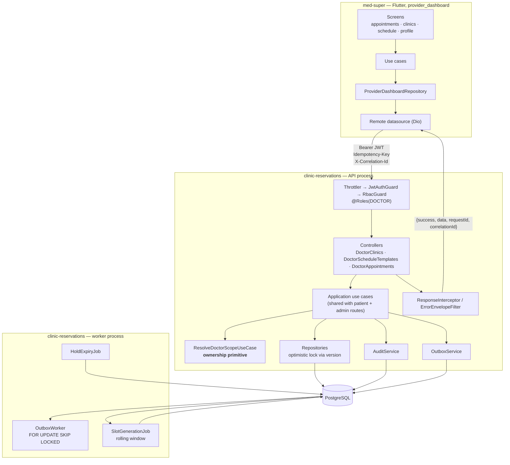
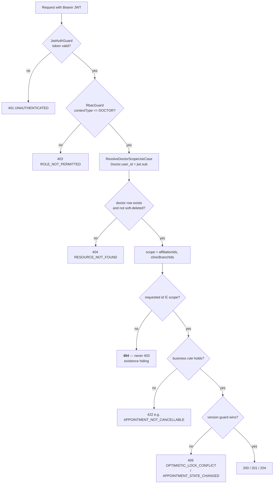
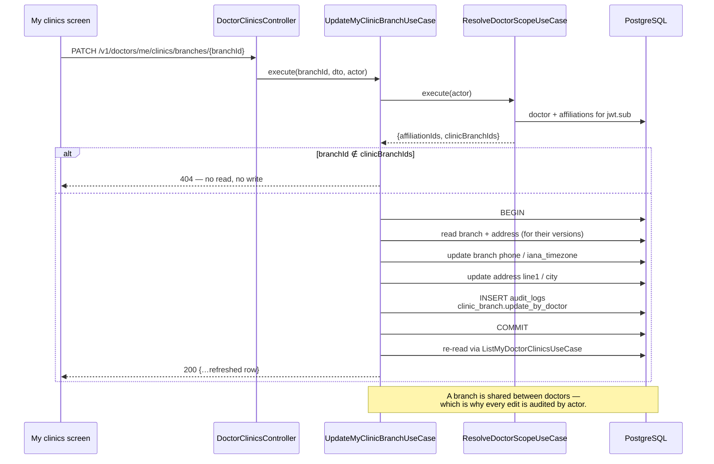
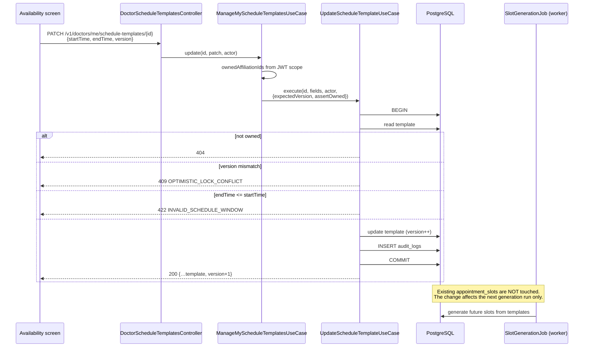
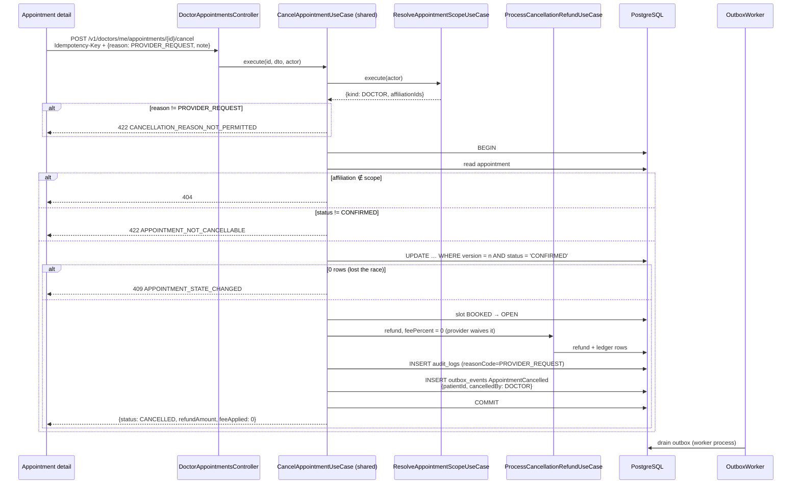
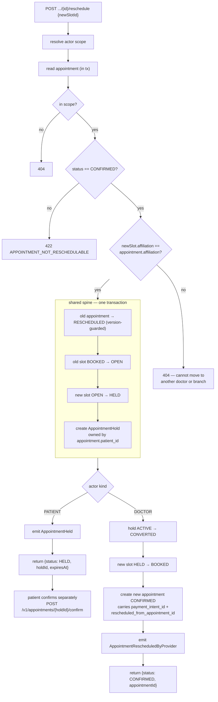

# Doctor Dashboard — architecture and flows

Companion to `FILE_12_Engineering_Decisions_And_Conventions.md` **Part 49**,
which carries the decisions and their rationale. This file is the picture.

Scope: the doctor-facing surface only — profile, clinics/branches,
availability, and the appointment queue including cancel and reschedule.
Patients and notifications are **not** covered; no backend module exists for
either yet, and the client still mocks them.

---

## 1. End-to-end topology



Two things this picture is meant to make obvious:

* **`ResolveDoctorScopeUseCase` sits in the application layer, not the
  controller.** Controllers forward path params; ownership is decided against
  the JWT-derived scope inside the use case, and for writes inside the same
  transaction as the write.
* **`AuditService` and `OutboxService` are written with the same `tx`** as the
  business change. Neither is a post-commit side call.

---

## 2. Authorization and ownership



| Rule | Where enforced |
|---|---|
| A doctor reads/edits only their own profile | `Doctor.user_id = jwt.sub` |
| A doctor sees only clinics/branches they are affiliated with | `scope.clinicBranchIds` |
| A doctor edits only branches they are affiliated with | `UpdateMyClinicBranchUseCase`, before any read |
| A doctor manages only their own affiliations' schedule templates | `assertOwned` predicate, inside the write transaction |
| A doctor reads/manages only their own appointments | `isAppointmentInScope`, inside the transaction |
| Ids from the client never define ownership | every id is re-checked against the JWT-derived scope |
| Cross-tenant ids are indistinguishable from missing ones | 404, never 403 |

---

## 3. Update the doctor profile

```mermaid
sequenceDiagram
    participant UI as Edit profile screen
    participant API as DoctorsController
    participant UC as UpdateMyDoctorProfileUseCase
    participant DB as PostgreSQL

    UI->>API: PATCH /v1/doctors/me {bio, degree, experienceYears}
    Note over API: @Roles(DOCTOR); ValidationPipe rejects<br/>licenseNumber/specialtyCode/status with 400
    API->>UC: execute(actor, dto)
    UC->>DB: findByUserId(jwt.sub)
    alt no doctor row
        UC-->>UI: 404 RESOURCE_NOT_FOUND
    else
        UC->>DB: BEGIN
        UC->>DB: update doctor (optimistic lock on version)
        UC->>DB: INSERT audit_logs<br/>provider_directory.doctor.update_self
        UC->>DB: COMMIT
        UC->>DB: re-read fresh profile
        UC-->>UI: 200 {…updated profile}
    end
    Note over UI: name/email go to PATCH /v1/auth/me —<br/>they live on User, not Doctor
```

---

## 4. Update clinic branch information



---

## 5. Update the doctor's schedule



---

## 6. Cancel an appointment as the provider



Everything between `BEGIN` and `COMMIT` is one transaction: the slot release,
the refund, the audit row and the outbox event either all land or none do.

---

## 7. Reschedule an appointment



The provider branch does not skip the hold: it creates and converts one in
the same transaction. What it skips is the client round-trip, because a
patient-owned 5-minute hold would strand the patient with no appointment
if they were not looking at their phone (Part 49.9).

---

## 8. Where each response comes from

| Client call | Backend | Scope resolved by |
|---|---|---|
| `GET /v1/doctors/me` | `GetMyDoctorProfileUseCase` | `Doctor.user_id = sub` |
| `PATCH /v1/doctors/me` | `UpdateMyDoctorProfileUseCase` | `Doctor.user_id = sub` |
| `GET`/`PATCH /v1/auth/me` | `identity-auth` | `User.id = sub` |
| `GET /v1/doctors/me/clinics` | `ListMyDoctorClinicsUseCase` | `ResolveDoctorScopeUseCase` |
| `PATCH .../clinics/branches/{id}` | `UpdateMyClinicBranchUseCase` | `scope.clinicBranchIds` |
| `PATCH .../clinics/affiliations/{id}` | `UpdateMyAffiliationUseCase` | `scope.affiliationIds` |
| `GET .../schedule-templates` | `ListMyScheduleTemplatesUseCase` | `scope.affiliationIds` |
| `POST/PATCH/DELETE .../schedule-templates` | `ManageMyScheduleTemplatesUseCase` → shared CRUD | `assertOwned` in-transaction |
| `GET .../appointments` | `ListDoctorAppointmentsUseCase` | `scope.affiliationIds` |
| `GET .../appointments/{id}` | `GetDoctorAppointmentUseCase` | `isAppointmentInScope` |
| `POST .../appointments/{id}/cancel` | `CancelAppointmentUseCase` *(shared with patient route)* | `ResolveAppointmentScopeUseCase` |
| `POST .../appointments/{id}/reschedule` | `RescheduleAppointmentUseCase` *(shared)* | `ResolveAppointmentScopeUseCase` |
